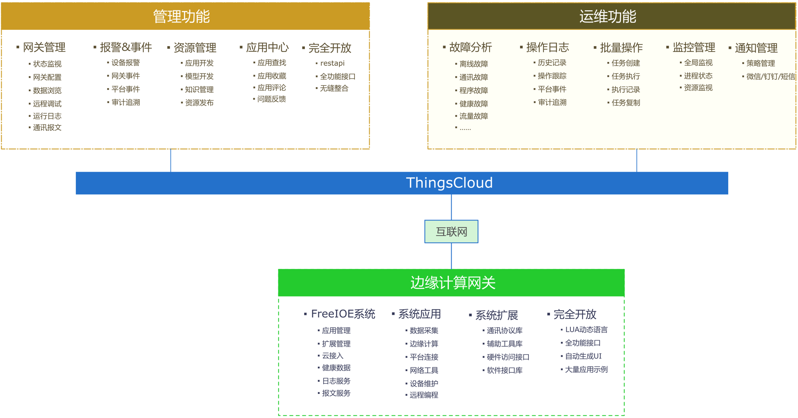

# 冬笋云

冬笋云是以物联网的边缘计算应用开发及管理为中心的企业级管理平台，提供简单易用的操作界面以及向导式操作方式，在降低用户使用边缘框架FreeIOE计算平台学习成本的同时，极大减轻开发、测试、运维的日常工作的复杂度，旨在解决工业物联网在边缘计算应用方面存在的开发，分发、网络、安全和易用性等痛点。除此之外，平台已经整合并优化了多个适用于工业物联网场景的功能模块，以完整的解决方案帮助企业轻松应对设备端数据的采集&加工、设备端数据的分析&过滤、设备端应用的开发&自动化分发部署、边缘计算节点的自动化运维、微服务治理、多租户管理、工作负载和集群管理、监控告警、日志查询与收集、服务与网络、应用商店、数据存储管理等多种业务场景。
后续版本还将提供和支持多集群管理、大数据、人工智能等更为复杂的业务场景。

整个冬笋云是由云端服务平台 [ThingsCloud](introduction/ThingsCloud/README.md) 和 边缘计算应用框架 [FreeIOE](introduction/FreeIOE/README.md) 组成。

