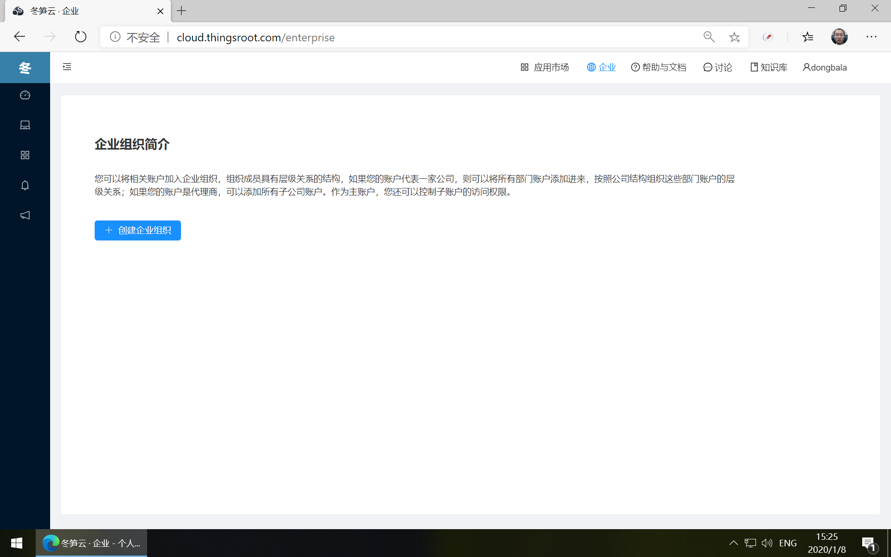
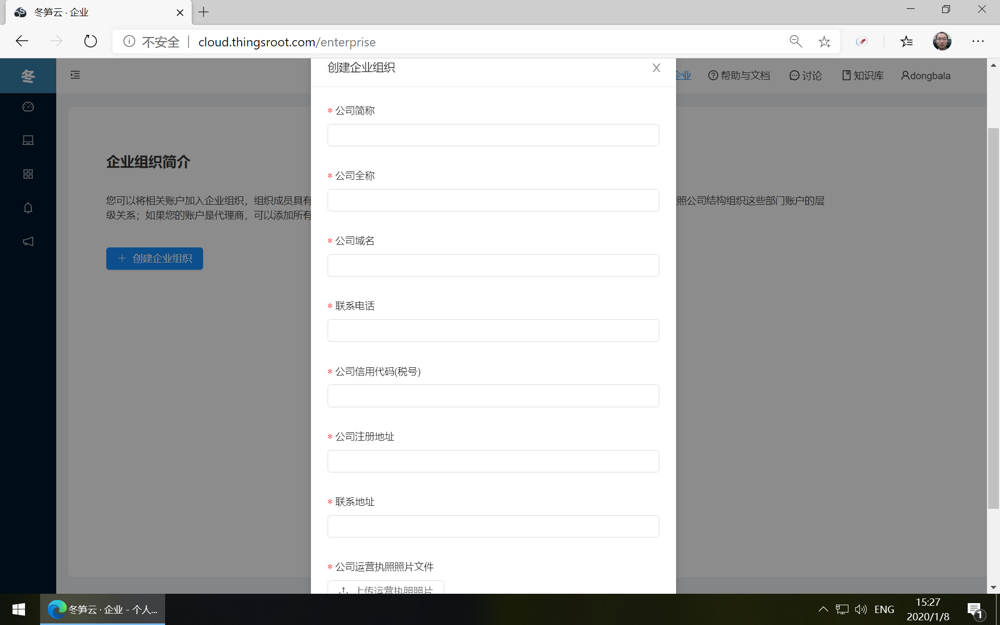
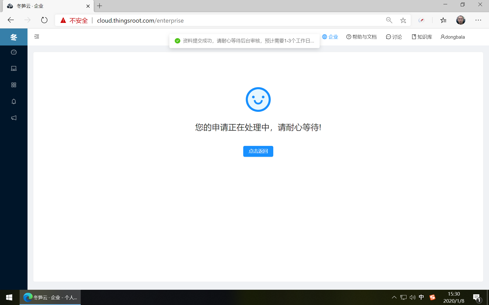

# 企业账户申请

在冬笋云平台注册的用户，默认都是个人用户，可以申请开通企业账户，点击顶部导航的“企业”，进入企业的功能页面，如用户当前不属于任何公司，则会出现申请公司账户的页面。

点击“创建企业组织”按钮。填写企业会员申请表单。输入必填信息及上传企业运营执照后，点击“创建”按钮。

提交信息后，等候平台审核，大约1~3个工作日就会出结果。

公司会员申请成功后，申请者默认就是此公司的管理员，公司管理员可进行[企业成员管理](member-manager.md)，还可以对企业[共享组管理](resource-manager.md)