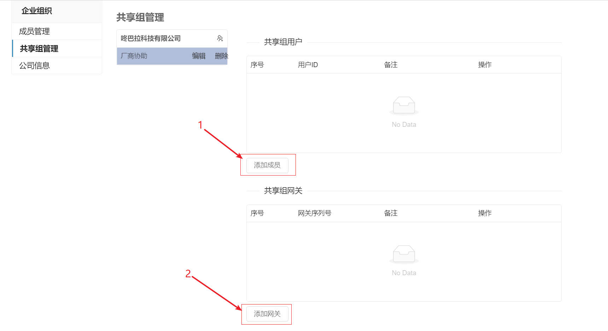

# 企业共享组管理

企业成员通过共享组，可将公司名下的网关分享给非自己公司的其他平台账户。公司管理员或普通成员点击顶部导航的“企业”，进入企业的功能页面，点击左侧的“企业组织”下的“共享组管理”。

在共享组管理下的公司名称右侧点击“新增共享组”的图标。输入共享组名称，点击确定按钮。

选中共享组后，点击“添加成员”按钮输入冬笋云平台中已注册用户的ID及用户备注进行保存。然后点击“添加网关”按钮，在弹出的网关选择面板中添加公司名下的网关后点确定即可。

对共享组中的用户和网关进行删除时，点击后面的操作按钮“删除”即可。

