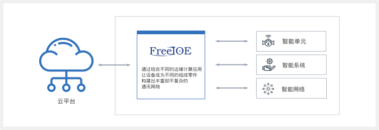
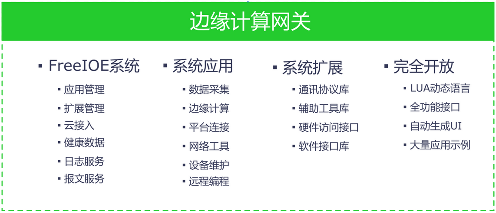

# FreeIOE 是什么

## 1. 概述

***[FreeIOE](http://freeioe.org)*** 是一个物联网边缘计算软件。该软件使设备能够收集和分析设备数据，自主应对本地事件，并可与本地网络上的其他服务进行交互。FreeIOE 开发人员可以使用 [Lua](http://lua.org) 语言和内置的一些功能模块来创建可部署到 FreeIOE 上的本地执行的应用程序。

FreeIOE 使客户能够构建 IOT 网关设备和边缘计算应用程序。并且 FreeIOE 对设备上运行的应用程序提供了在线的平台式远程管理。本地部署的 FreeIOE 应用程序可以进行设备通讯，数据计算处理，数据上送以及平台的互动等。

本地部署的 FreeIOE 应用程序可以在本地进行数据交换，而不必连接到云。FreeIOE 提供了方便完善的本地数据发布/订阅接口，也提供了程序间一对一的通讯接口。并且在本地智能地缓存数据，当云平台的连接在短时间断开时得以保护数据的完整性和持续性。

FreeIOE 也是一个开源的软件，客户可在不同的嵌入式硬件上快速构建边缘计算节点，以适配不同的场景或成本需求。

<!-- [FreeIOE](https://github.com/freeioe/freeioe)  是一个为快速开发工业物联网（IIOT）边缘计算应用而产生的开发框架。具有极简开发，端云一体，大量应用等关键能力，可广泛应用于智慧工厂，智慧城市等工业物联网领域。 -->

### 1.1. 产生背景

[FreeIOE](https://github.com/freeioe/freeioe)  是在[skynet](https://github.com/cloudwu/skynet) 开源项目上结合IIOT边缘计算的部分应用场景及业务特点产生的，本意是为了解决搭建工业物联网（IIOT）系统时快速开发工业现场设备数据采集应用，快速对数据预处理，快速连接各种物联网平台等需求。而当[FreeIOE](https://github.com/freeioe/freeioe) 研发完成后，我们发现使用[FreeIOE](https://github.com/freeioe/freeioe) 不仅可以快速开发各种IIOT应用，同时也提供了应用在线安装，应用管理，扩展管理，应用日志，通讯报文，云连接等功能；另外，为了使用者能通过互联网更方便的管理和运维分布在全球的FreeIOE运行节点，我们开发了FreeIOE的运维平台[ThingsCloud](https://cloud.thingsroot.com)，通过ThingsCloud，使用者可以非常方便的在管理及运维自己名下的所有FreeIOE节点。因此，使用[FreeIOE](https://github.com/freeioe/freeioe) + [ThingsCloud](https://cloud.thingsroot.com) 来开发，分发，管理，追溯，批量部署IIOT边缘计算应用就变得非常简单和方便。

### 1.2. FreeIOE和传统的工业数据采集软件的区别

FreeIOE的设计目标及产品定位和传统的工业数据采集软件有着很大的区别，这么说并不就是说FreeIOE比传统的工业数据采集软件多好多强，我们从各自的设计目标来看：

    传统的工业数据采集软件主要功能是解决将现场的各种设备和系统的数据由多厂家、多协议、行业标准协议、厂家私有协议等转为某一种行业的标准协议，本身考虑的应用场景是工厂内部，因此对于物联网平台这种采集节点分散，希望统一的管理运维以及配置平台化的需求是没有考虑的。

    FreeIOE的定位是物联网平台中边缘计算的节点，因此从设计之初就采用了分层设计，组件化，模块化，全开放的设计思想。而且将FreeIOE的远程配置，管理运维作为一个基础的功能提供。之所以这么设计，我们深刻认识到物联网平台的本质并不只是工业数据的汇聚和客户业务+互联网的叠加，而是使用各种新技术构建全新生产力工具对用户业务的升级。我们认为FreeIOE不再只是物联网平台的数据采集转发节点，而是在构建一个庞大的分布式边缘计算网络，因此，FreeIOE是一个完全开放的边缘计算应用开发框架，不仅可以完成我们常规认为的数据采集，数据预加工，数据上云等基本功能，还能实现很多用户定制化的需求和应用，为用户提供无限可能的想象空间。

每一个产品都有自己的定位，FreeIOE深度的贴合了工业物联网的当前需求及未来的发展需要，同时也很好的借鉴了大量传统的工控软件的功能及优点。