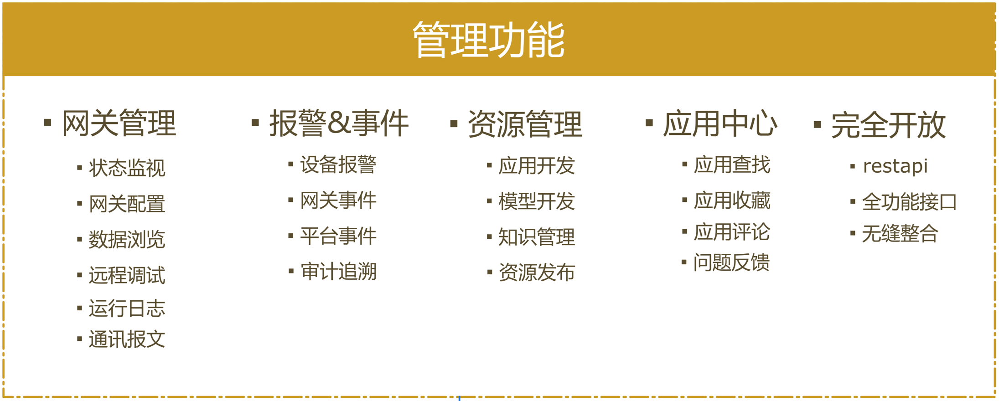
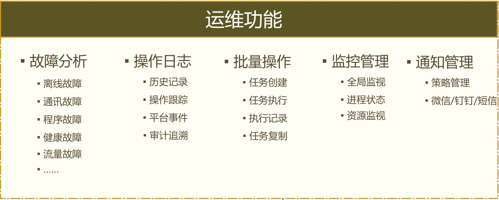

# ThingsCloud 是什么

ThingsCloud 是一款对FreeIOE边缘计算节点云管理设计的开放平台，针对工业物联网边缘计算的位置分散性、厂商繁多性、业务多样性等特点而原生设计的，对内置了FreeIOE边缘计算应用框架的盒子提供简单易用的操作界面以及向导式操作方式，在降低用户使用FreeIOE开发边缘计算应用的同时，极大降低开发、测试、运维的日常工作的复杂度。并提供了全功能、全开放的REST API，可方便和企业的业务系统无缝整合。

