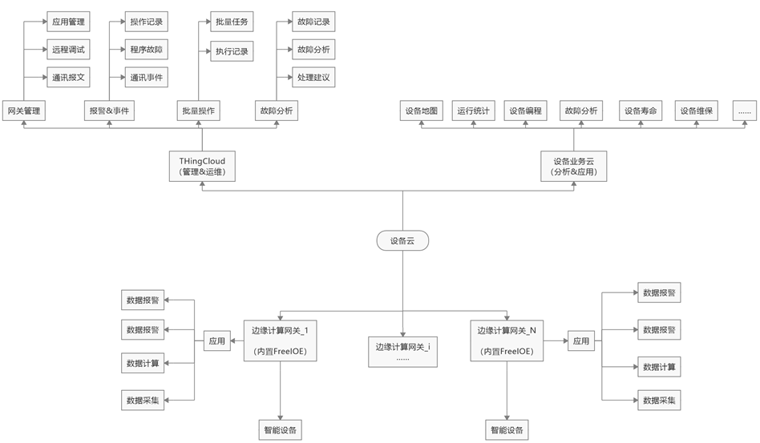
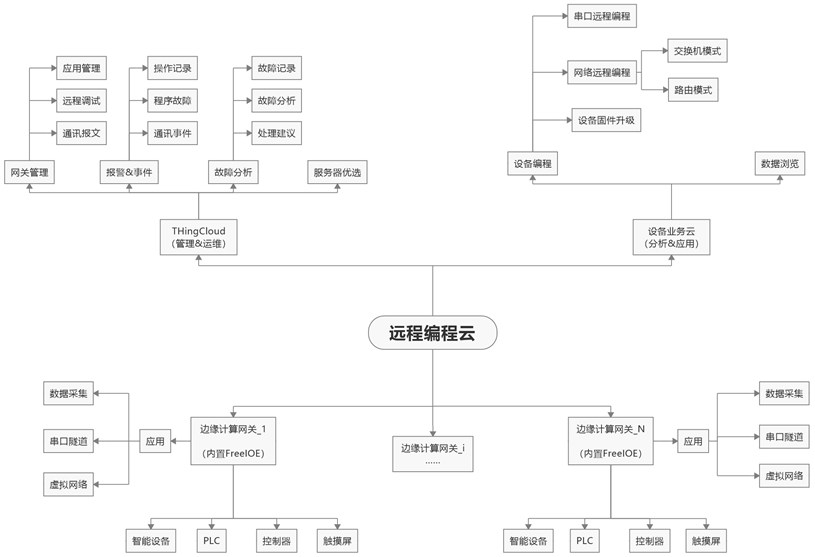

# 应用场景

FreeIOE + ThingsCloud 适合企业在数字化转型及构建智能化的物联网业务平台时所需的边缘应用快速开发与边缘节点的自动化运维、自动弹性伸缩和业务高可用，端云智能化协同等应用场景。

### 设备运维云之智能适配

* 上线自动适配

* 平台自动分发

* 所有操作跟踪记录

* 快速开发并批量部署

### 工业设备云之远程编程

* 兼容所有以太网或串口智能设备

* 自动选择最优链路，低延时

* 点对点局域网，虚拟网络，虚拟串口
