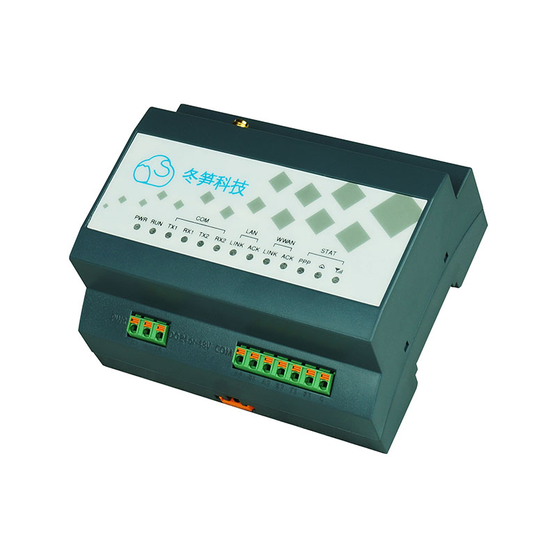
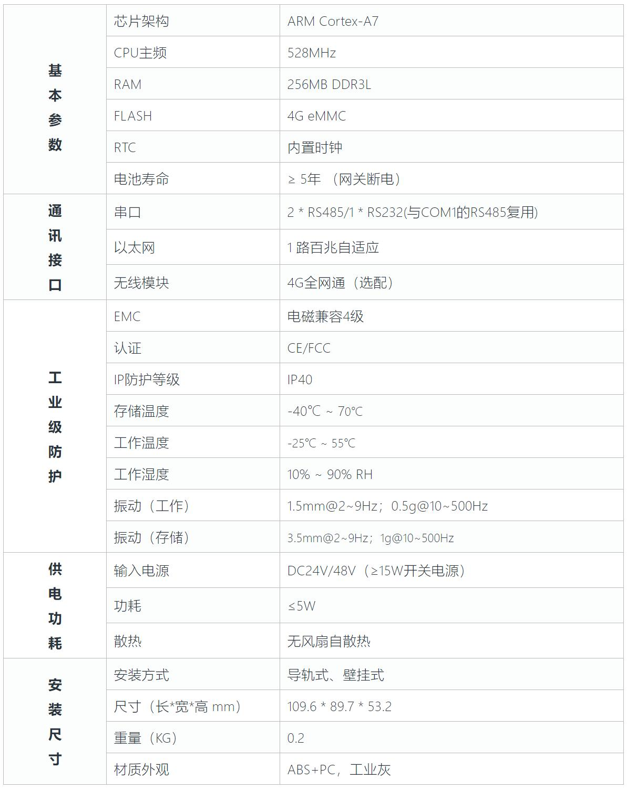
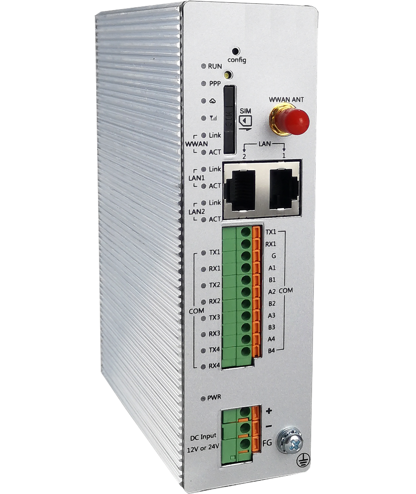
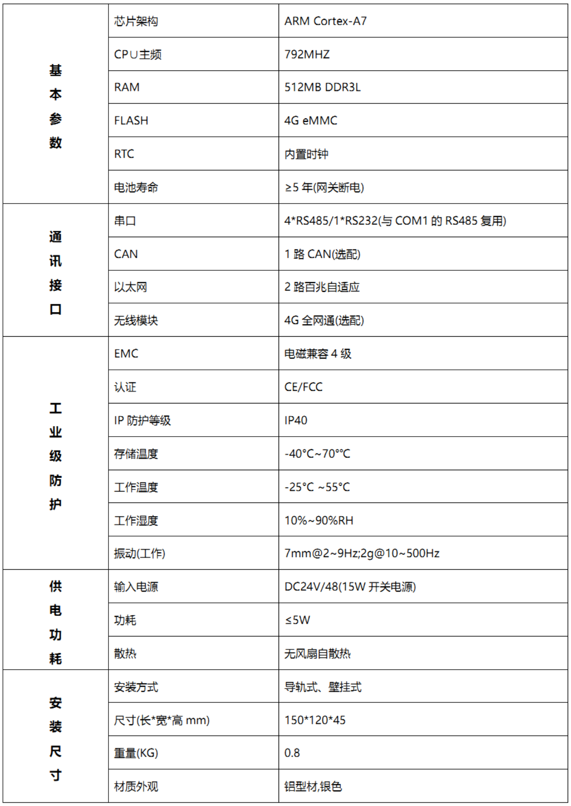
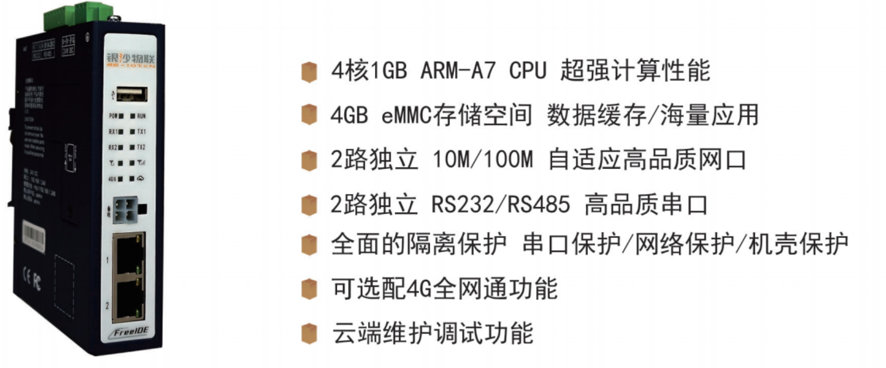
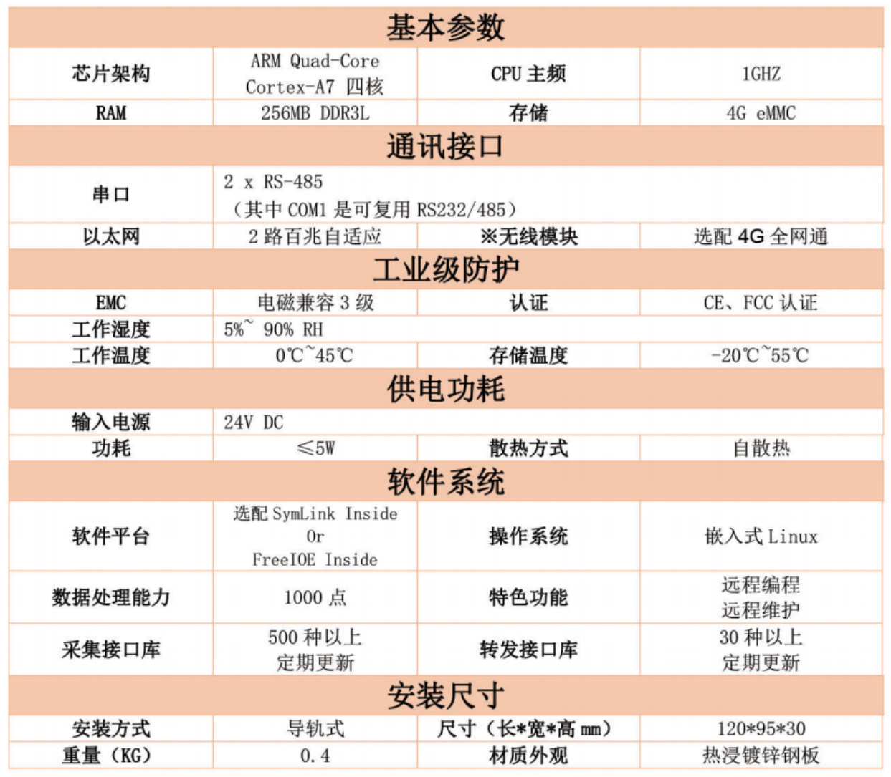

# ThingsLink 产品简介

ThingsLink云网关是基于物联网边缘计算应用开发框架[FreeIOE](https://github.com/freeioe/freeioe)项目精心定制的一款物联网边缘计算网关，网关采用国产ARM CPU + openwrt操作系统 + 边缘计算应用框架 FreeIOE 定制版的技术方案，提供多种物理链路和多种安装方式，并结合云配置/云运维的方式为工业物联网用户提供设备一键上云、端云融合的极致体验。

| ThingsLink Q102                                             | 技术规格                                                     |
| ----------------------------------------------------------- | ------------------------------------------------------------ |
|  |  |

| ThingsLink Q204                                             | 技术规格                                                     |
| ----------------------------------------------------------- | ------------------------------------------------------------ |
|  |  |

| 智能银盒C202                                                 | 技术规格                                                     |
| ------------------------------------------------------------ | ------------------------------------------------------------ |
|  |  |

