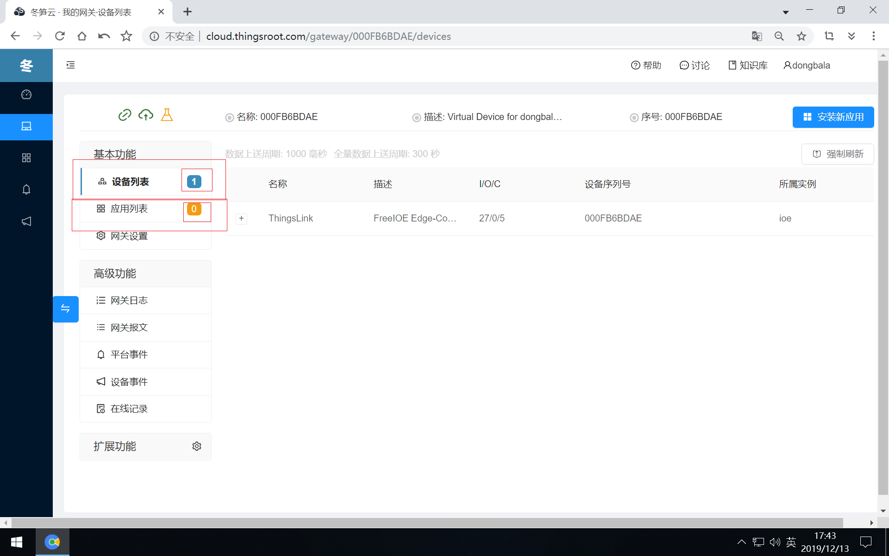

#  演示应用场景介绍

一台全新的网关，如没有安装过FreeIOE的应用，那么网关是没有什么功能的，在FreeIOE的应用列表中是没有任何应用在运行，设备列表中也仅仅只有网关自身的运行状态数据。

# 演示应用场景介绍

在本快速入门中，使用的快速体验场景介绍如下：
1. 相关软件：
   1. FreeIOE虚拟网关
   2. Modbus模拟器
   3. MQTT Broker & MQTT Client
2. 演示功能：
   1. 通过平台给远程的FreeIOE网关安装Modbus采集应用
   2. 配置Modbus采集应用采集Modbus模拟器的数据
   3. 通过平台查看并验证Modbus模拟器的数据是否正确
   4. 通过平台给远程的FreeIOE网关安装MQTT应用
   5. 配置MQTT应用并选择上传Modbus模拟器的数据
   6. 通过MQTT Client订阅Modbus模拟器的数据并向Modbus模拟器写入数据
3. 演示目的：通过冬笋云平台可以非常方便的配置维护远程网关，实现物联网平台数据的上行和下行。

在前面的章节中，我们已经完成了FreeIOE虚拟网关的部署运行，也运行了Modbus模拟器，接下来我们介绍在冬笋云平台中给FreeIOE虚拟网关[查找适合设备的应用](find-freeioeapp.md)。

