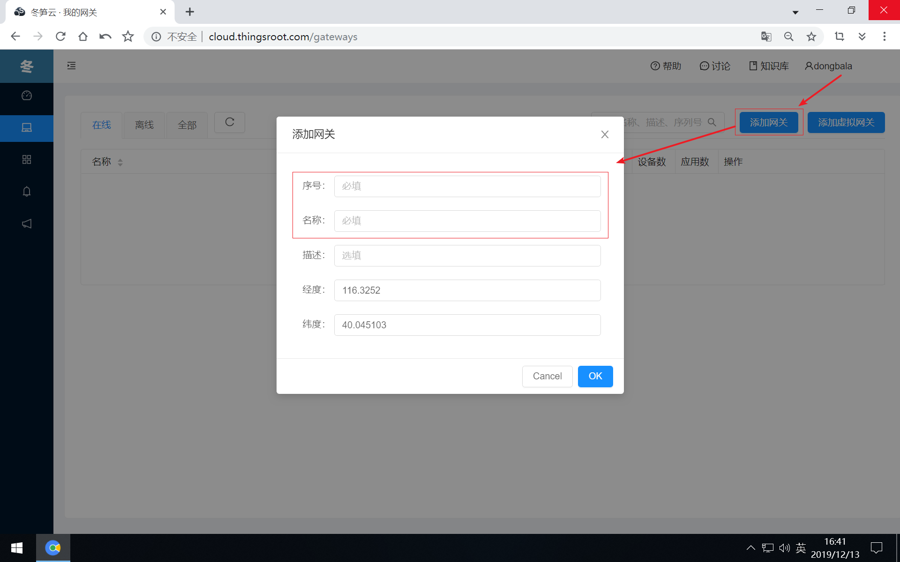
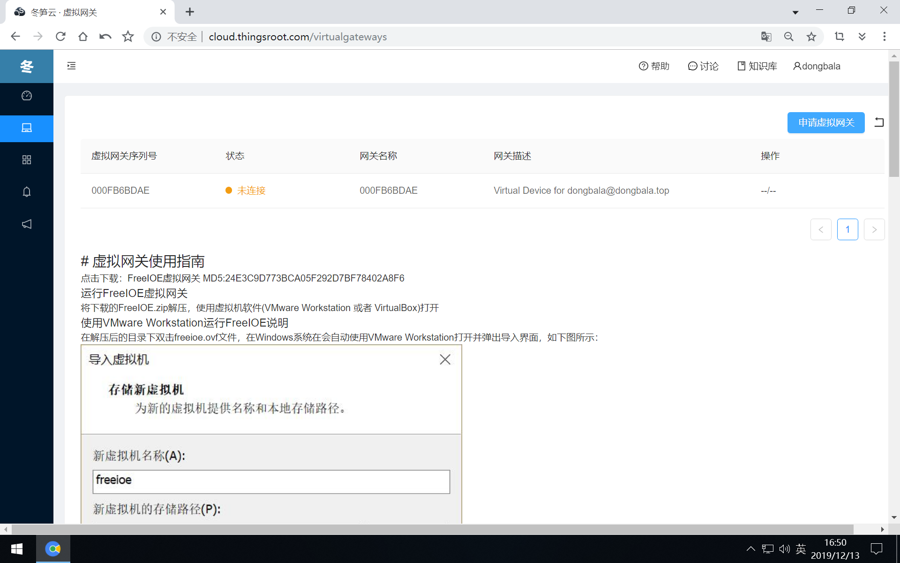
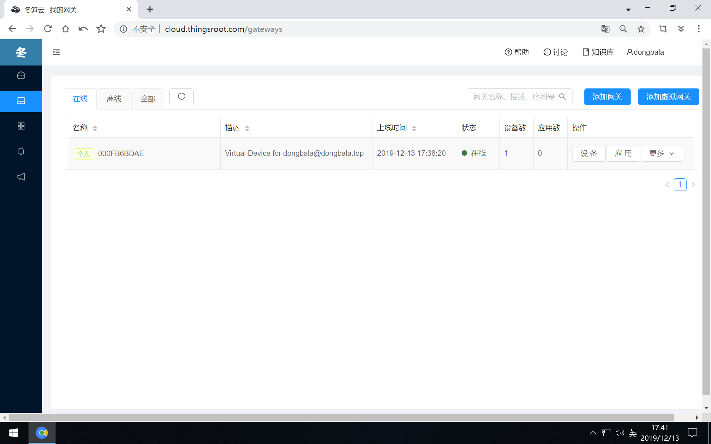

# 绑定网关
如要将网关绑定到账户名下，需要将页面切换到“我的网关”，通过左侧导航栏的“我的网关”图标切换。在“我的网关”页面，目前未绑定任何网关。

## 绑定ThingsLink网关

如手中有ThingsLink网关，点击“添加网关”按钮，输入网关序列号并输入网关名称和描述后点击“OK”按钮即可。

    注意:如手中要绑定的ThingsLink网关型号是Q102或Q204，请先联系平台管理员先注册当前网关的序列号，否则，无法绑定成功。

## 绑定FreeIOE虚拟网关

如手中暂时没有ThingsLink网关，又想了解冬笋云的功能，那么点击“添加虚拟网关”按钮进入FreeIOE虚拟网关的说明页面。

点击“申请虚拟网关”按钮，为当前账户申请注册几个测试的虚拟网关序列号，将此序列号设置到本地运行的FreeIOE虚拟网关中，就可绑定到自己名下。

在FreeIOE虚拟网关中设置序列号并重启后，在“我的网关”页面中就能看到此虚拟网关已经在线了。

将网关绑定到账户名下后，接下来就可进行[网关配置](find-freeioeapp.md)。