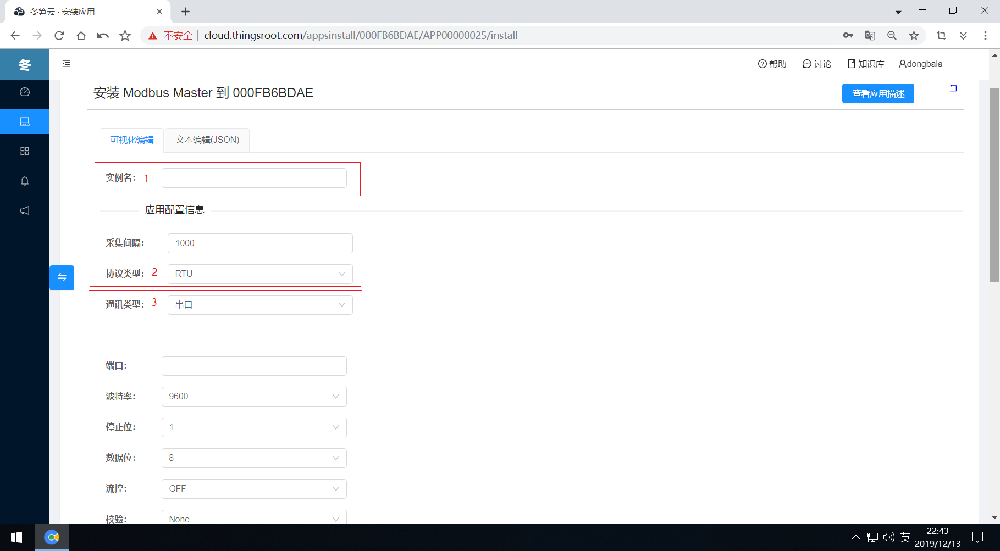
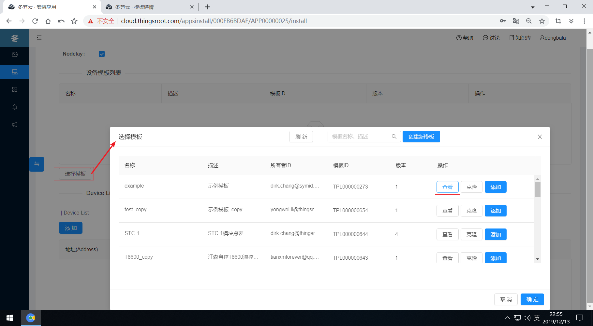
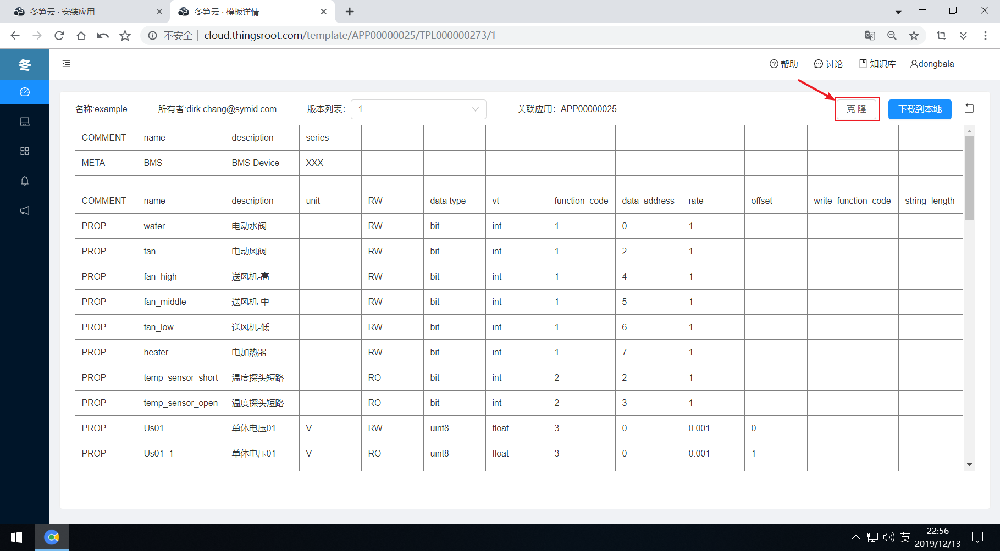
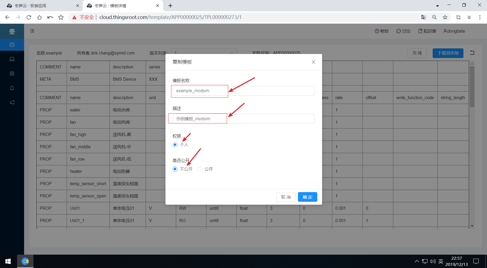
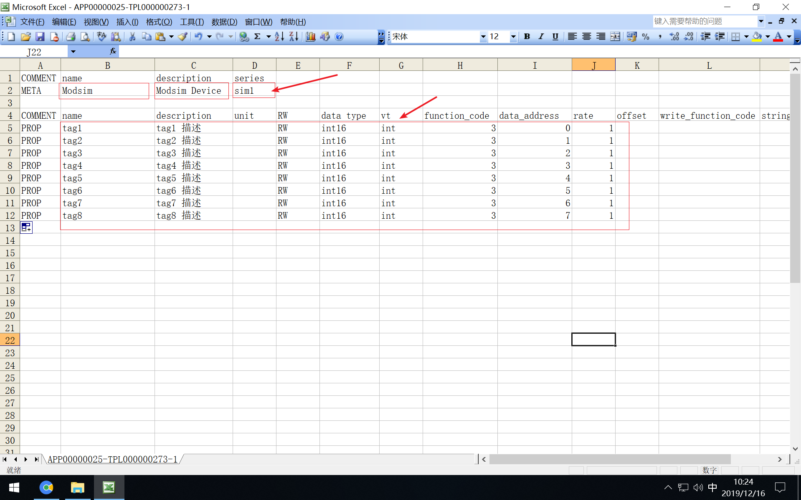
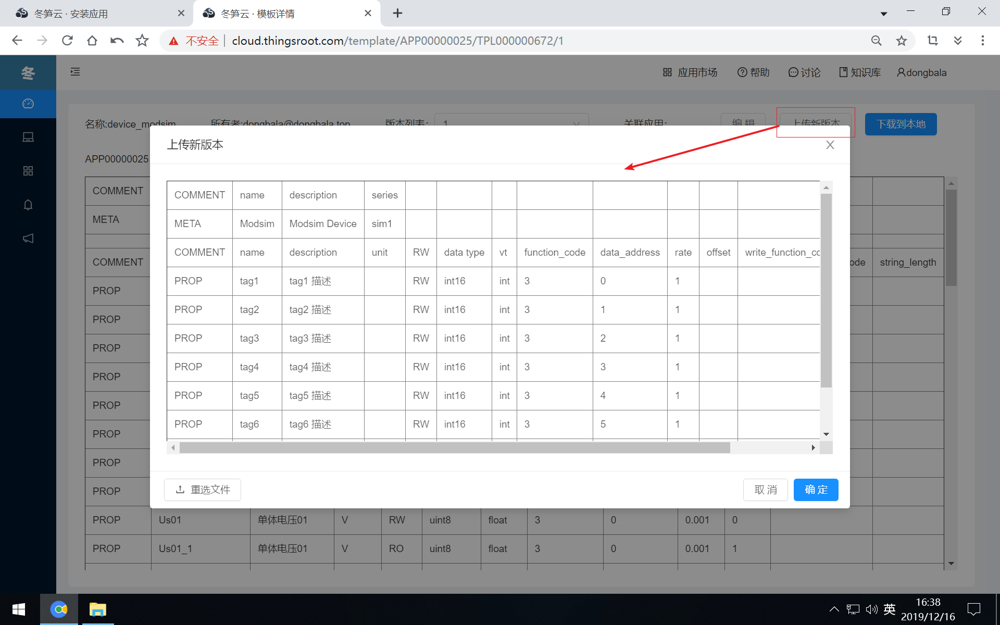

# 参考样例创建设备模板

给目标网关安装FreeIOE应用的过程中，每一个FreeIOE应用的配置参数并不一样，而且大多数FreeIOE应用都和行业标准协议或行业业务相关，因此在配置FreeIOE应用参数时，需要具备FreeIOE应用背后的行业知识。拿当前的演示应用场景来说，就需要了解Modbus协议的相关知识，对于FreeIOE应用背后的行业知识及相关经验，冬笋云平台建立了FreeIOE知识库系统和社区来帮助大家快速的获取相关的知识和经验，Modbus Master应用相关的知识可点击链接[Modbus Master 使用说明](https://wiki.freeioe.org/doku.php?id=apps:app00000025)了解。

第一步，在安装界面需要确定应用在网关中运行的实例名称，在FreeIOE框架中，实例名必须唯一，而且实例名只支持英文字符+数字的组合。

第二步，定义完实例名，还需要继续选择Modbus采集的协议类型和通讯类型，在本次测试的场景中，和Modsim通讯是使用Modbus TCP协议，和Modsim模拟器是通过TCP/IP方式通讯。因此这里协议类型需要选择“TCP”，通讯类型选择“TCP连接”，通讯类型选择“TCP连接”后，我们还需要填写Modsim模拟器的IP地址和端口号。在本次演示场景中，Modsim模拟器的IP地址是192.168.174.1，端口号是502。在实际应用场景中，需要根据实际情况填写。

第三步，需要选择目标采集设备（这里是Modsim模拟器）的设备模板。
选择模板

查看模板参考样例

克隆样例模板到自己名下并定义名称

下载模板到本地，再使用Excel等软件编辑模板。设备模板中列字段的含义及说明请参考[Modbus Master 使用说明](https://wiki.freeioe.org/doku.php?id=apps:app00000025)中设备模板部分的描述。

在本地将设备模板编辑修改完成后，就可为刚才克隆到自己名下的模板上传新版本。

浏览上传的点表是否正确，如不正确，可重新上传。如确认无误，则点击确定按钮上传。

如同时要采集多个不同点表的设备，那么就需要创建多个设备模板，重复第三步的过程，创建多个自己的设备模板。设备模板创建完成后，就可进入[采集设备数据](data-collection.md)部分。