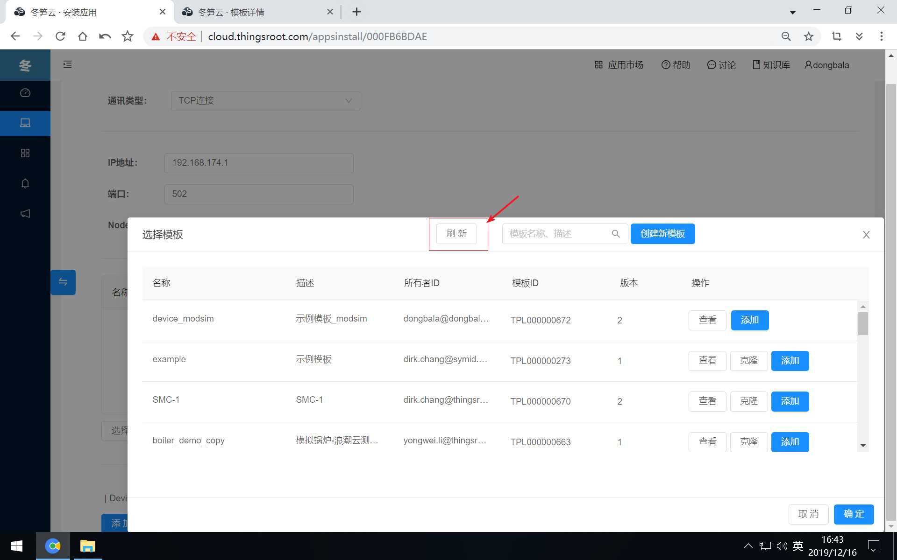
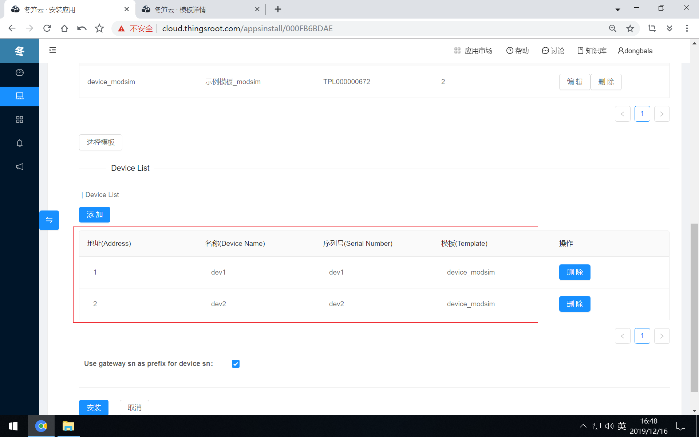
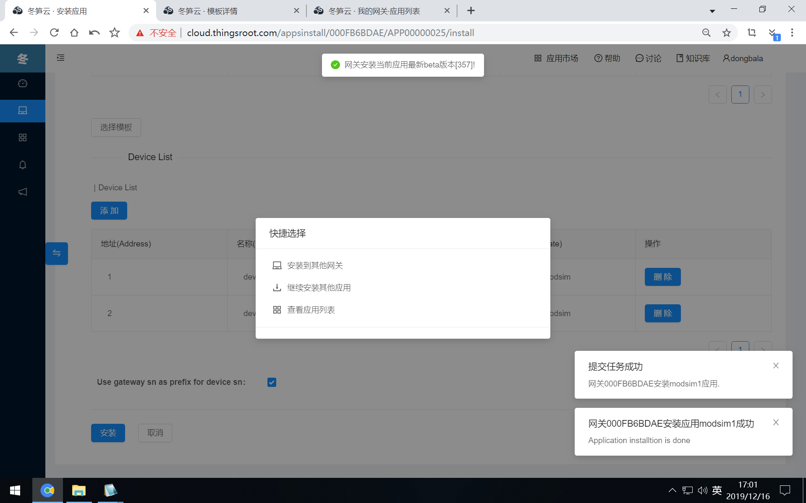

# 采集设备数据

第四步，在安装应用页面中选择需要的模板（点击刷新按钮获取最新的设备模板及版本）

第五步，定义采集的目标设备的Modbus地址等信息(添加设备，定义设备地址，设备名称，设备序列号，选择对应的设备模板）。
设备参数表格中的选项描述如下表：

| 项目       | 描述                                         |
| :--------- | :------------------------------------------- |
| 地址       | Modbus协议中定义的设备地址                   |
| 设备名称   | 设备实例名称                                 |
| 设备序列号 | 设备序列号，当前网关下面需要保证序列号唯一。 |
| 模板       | 设备模板                                     |
| 操作       | 从表格中删除设备                             |

最后，点击安装按钮即可。

如“Modbus Master”应用成功安装到目标网关中，将看到如下提示。

接下来，[查看设备数据](data-view.md)一节让我们可以了解如何查看目标设备的数据是否采集到？是否正确？下置数据是否正确？

