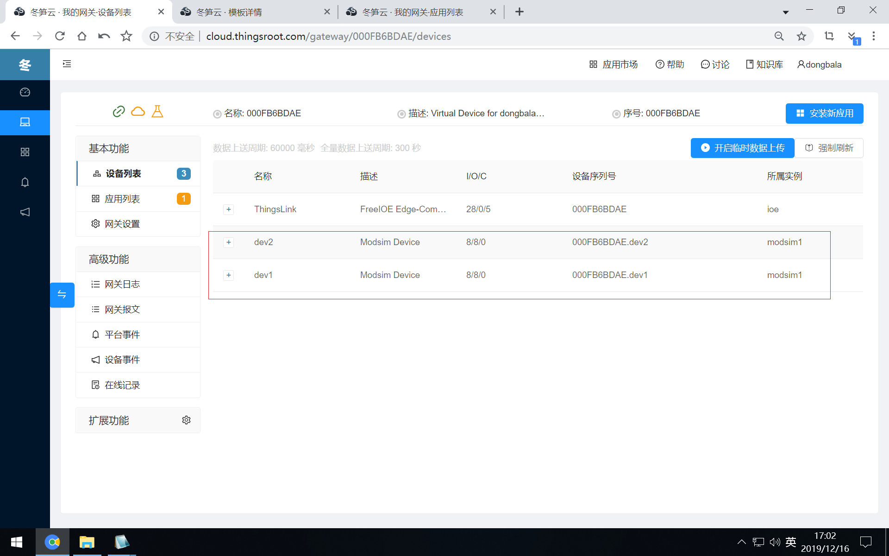
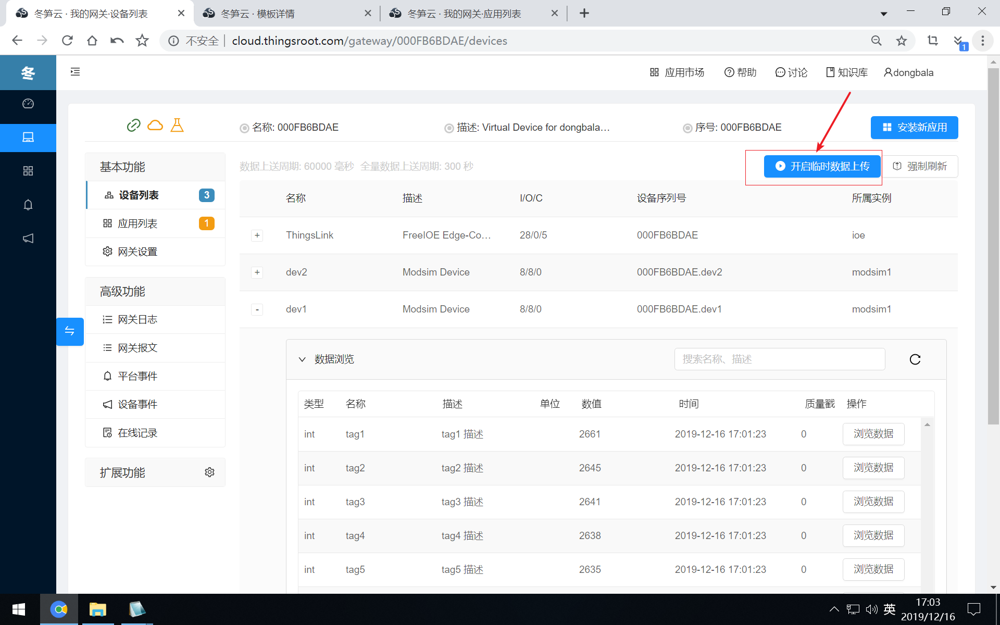

# 查看设备数据

前面的内容我们仅仅是在目标网关中安装了采集目标设备的应用，目标设备的数据是否采集到？数据是否正确？这是本节主要介绍的内容。

通过网关配置页面中左侧导航的“设备列表”功能，我们可以查看目标网关中当前的设备列表。设备列表中名称为ThingsLink的设备为网关自己的系统变量和状态变量。如有其他的设备，那都是网关中安装的应用创建的，如网关中的应用没有运行，那么和应用相关的设备不会出现。

在前一节内容中安装的FreeIOE应用 Modbus Master 如运行正常，在这里我们就可看见设备列表中会出现在 Modbus Master 配置界面中添加的多个Modbus设备。

点击某个设备，点击的设备就会在页面展开，显示出设备中的标签变量以及变量当前的实时数据（时间戳，数值，质量戳）。这里需要注意的是：由于网关的默认配置不会将网关应用创建的虚拟设备数据上传到冬笋云平台（数据上传到冬笋云平台可通过网关设置中的高级设置开启），因此，我们打开“设备列表”页面时，是看不到远程设备的实时数据的。如需要查看设备的实时数据，需要点击设备列表右上方的“开启临时数据上传”按钮。“开启临时数据上传”后，大约2,3秒后，就可看见设备中的标签变量的数据在变化（由于FreeIOE上传数据采用的是数值变化传输机制，只有当数值发送变化时，数据才会上传到云平台）。

如果设备标签变量的数值并未实时变化，我们可观察一下数值后面的时间戳是否是当前时间？质量戳是否是0？如是，则说明是设备源头的数值变化不频繁；如不是，则说明网关中应用和设备之间的通讯可能存在问题。这就需要我们通过网关的日志系统和报文系统去诊断排查相关问题在哪里？由于设备的数据采集故障诊断和分析涉及内容较多，在本节就不展开描述了，如您在体验用FreeIOE网关采集Modbus设备数据遇到故障时，可参阅[Modbus Master 常见问题](https://wiki.freeioe.org/doku.php?id=apps:faq:app00000025)来查找问题的解决办法，或者通过[FreeIOE社区](https://freeioe.org)去寻找答案或在社区提出问题。

这里的演示场景中，网关采集到正确的数据并不是我们的最终目的，我们还需要将网关采集到的数据上传到指定的接收平台（这里的演示场景我们是搭建了一个MQTT Broker），接下来，我们在[设备数据转发MQTT平台](data-forward.md)一节中介绍如何在网关中安装并配置“智能云平台”应用将网关中指定设备的数据上传到MQTT Broker。
