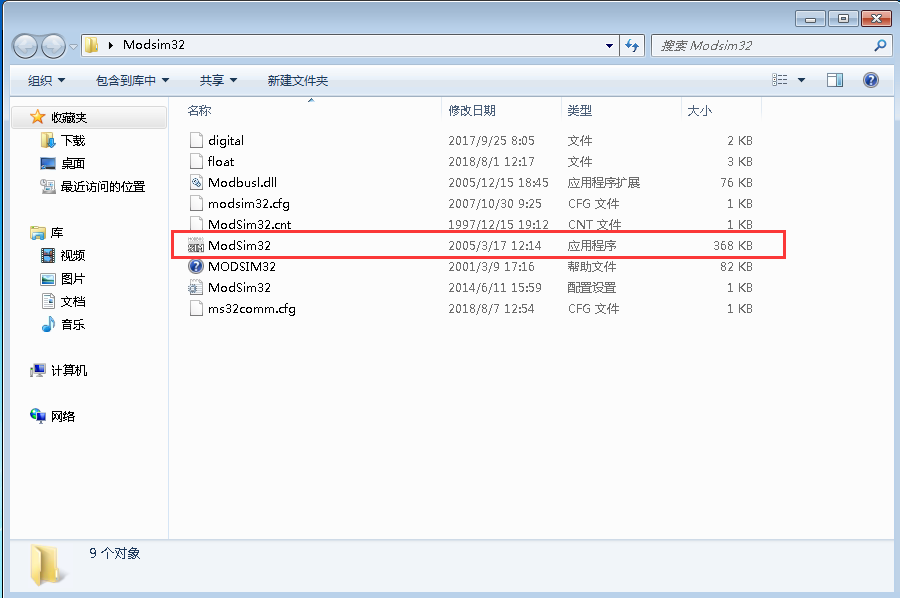
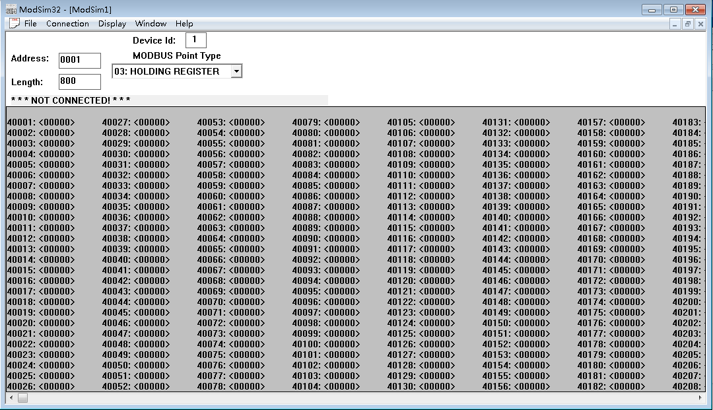
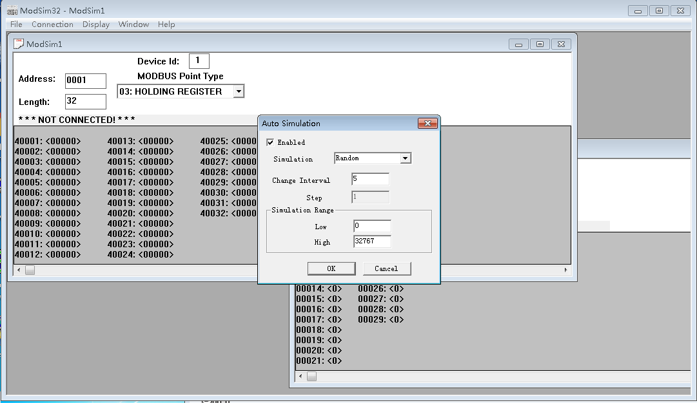
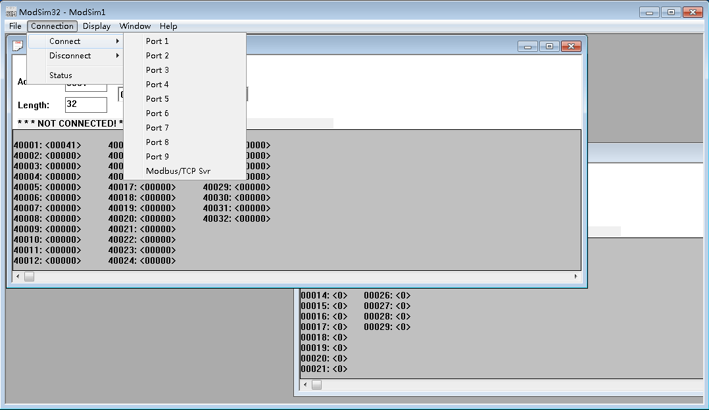
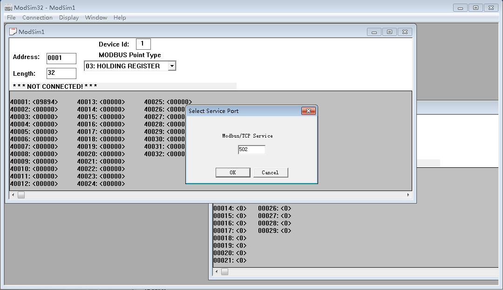

# 工业设备/模拟器

如你手中有带有RS 232/RS 485或者以太网接口的智能设备，那么你就可以参考设备厂商的使用说明将设备和ThingsLink网关连接在一起。

如你没有真实的智能设备，也可以按照如下步骤，通过设备模拟器软件来测试。

## Modbus仿真工具

Modbus的仿真工具很多，使用符合标准的哪一种Modbus仿真工具都可以。这里我使用Modsim32软件来模拟Modbus设备，作为配对的测试工具，modscan32是一个Modbus协议的验证工具。

1. 将Modsim32.zip解压后，运行文件夹中的Modsim32程序。

2. Modsim32运行后，界面一片灰白，目前未添加任何模拟标签以及相关设置。

3. 我们可以使用预先设置保存的模板或者新建1个标签模板。新建（快捷键Ctrl + N）1个标签模板，可以更改Modbus模拟设备的设备地址（Device ID），开始寄存器地址（Address），总长度（Length），功能码（Modbus Point Type）。

4. 通过快捷键Ctrl + N，可以创建多个Modbus模拟设备、根据测算需要修改相应的设备地址（Device ID），开始寄存器地址（Address），总长度（Length），功能码（Modbus Point Type）已经每个寄存器的数据变化规律（鼠标双击寄存器地址就可对寄存器的数据变化规律进行配置）。

5. 模拟设备配置完成后，需要对通讯相关参数进行配置（也就是对外提供的链路连接方式及相应的配置参数）。点击菜单栏中的“Connection”，在“Connect”中选择串口或者TCPServer方式。

6. 在弹出的界面中定义串口波特率或者TCPServer的端口即可完成Modbus仿真器的配置。如是在开启了网络防火墙的操作系统中使用此软件，还需在防火墙中开启此软件使用Modbus TCP时开启的端口，默认是TCP协议502端口。

## OPCUA仿真工具

OPCUA作为一个开发的行业标准协议，相关的OPCUA 仿真软件也比较多，本文使用的OPCUA 仿真Server是由Prosys公司提供的Prosys OPC UA Simulation Server。Prosys OPC UA Simulation Server安装运行后无需配置。

本文提及的模拟软件下载直链地址如下:

Modsim32：[http://thingscloud.oss-cn-beijing.aliyuncs.com/download/Modsim32.zip](http://thingscloud.oss-cn-beijing.aliyuncs.com/download/Modsim32.zip)

Prosys-OPC-UA-Simulation：[http://thingscloud.oss-cn-beijing.aliyuncs.com/download/prosys-opc-ua-simulation-server-2.3.2.exe](http://thingscloud.oss-cn-beijing.aliyuncs.com/download/prosys-opc-ua-simulation-server-2.3.2.exe)

Prosys-OPC-UA-Client：[http://thingscloud.oss-cn-beijing.aliyuncs.com/download/prosys-opc-ua-client-2.3.2.exe](http://thingscloud.oss-cn-beijing.aliyuncs.com/download/prosys-opc-ua-client-2.3.2.exe)

如是使用ThingsLink网关智能银盒C202 进行快速入门的测试，我们看一看智能银盒C202的[安装&接线&联网](Gate-installation.md);如是使用FreeIOE虚拟机，直接进入[注册&登录](register-and-login.md)这一节。