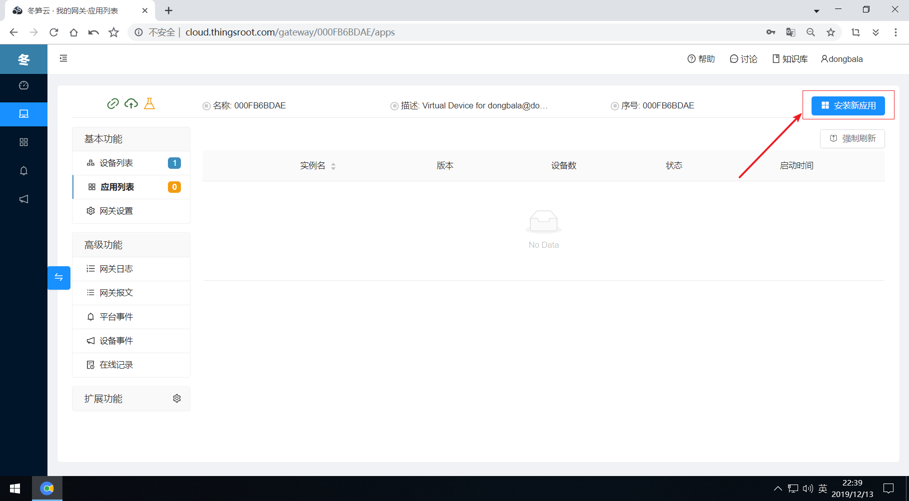
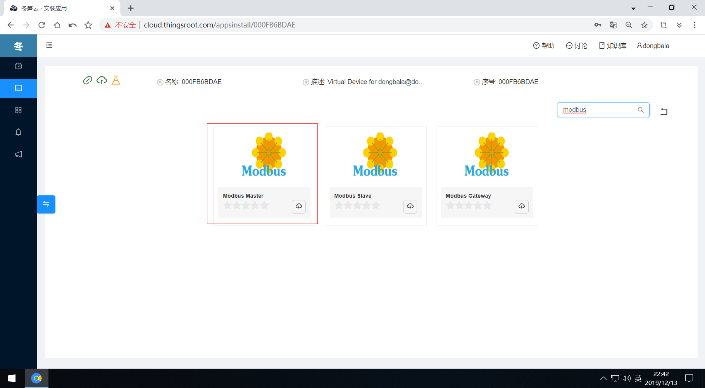

# 查找适合设备的应用

在前面我们介绍本次的演示场景主要是采集Modbus模拟器的数据。因此，我们在给FreeIOE网关安装应用时，就需要在冬笋云平台上找到能采集Modbus设备数据的应用。

在“我的网关”页面，点击设备或应用按钮进入网关的配置界面，点击网关状态栏右边的“安装新应用”按钮。

在选择应用的页面中，输入“modbus”关键词进行过滤，页面将符合“modbus”关键词的应用列出。

这里我们选择“Modbus Master”应用，点击应用图标或者直接点击安装图标。接下来[采集设备数据](data-collection.md)一节就是对“Modbus Master”应用的工作参数进行配置以及创建并编辑目标设备的设备模版（即设备点表）。
