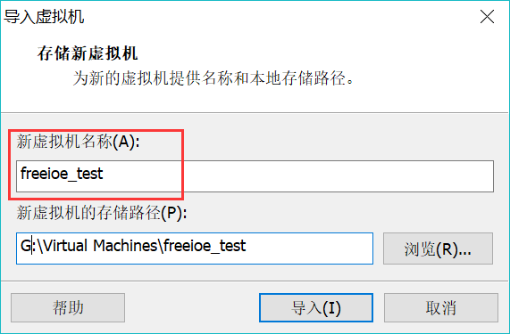
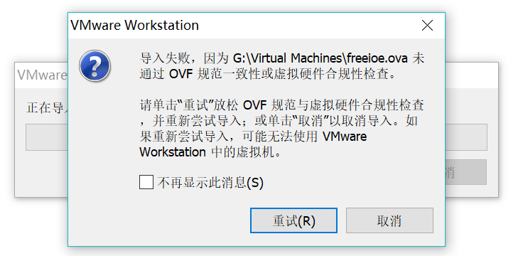
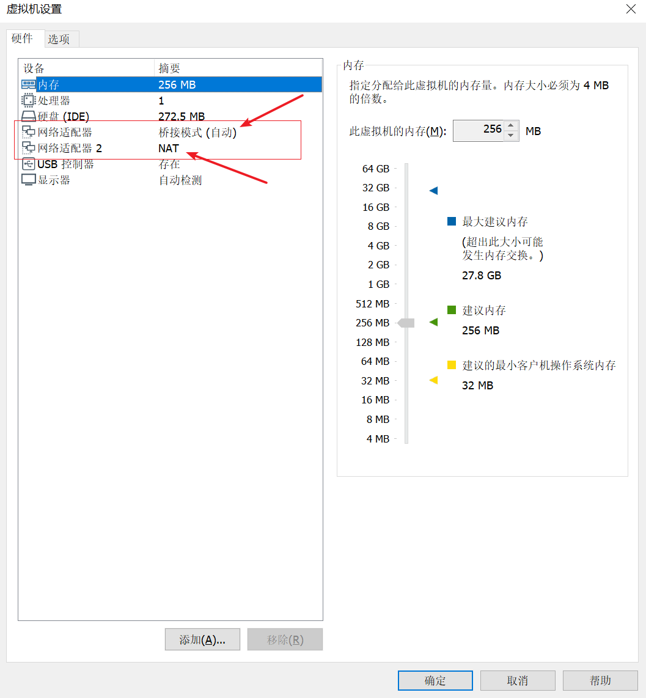
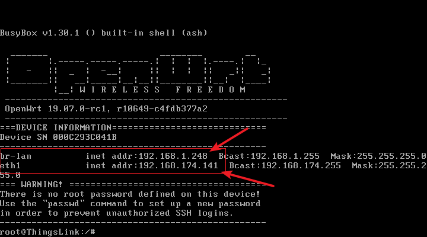
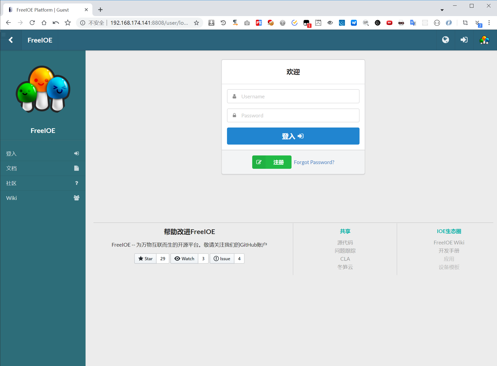
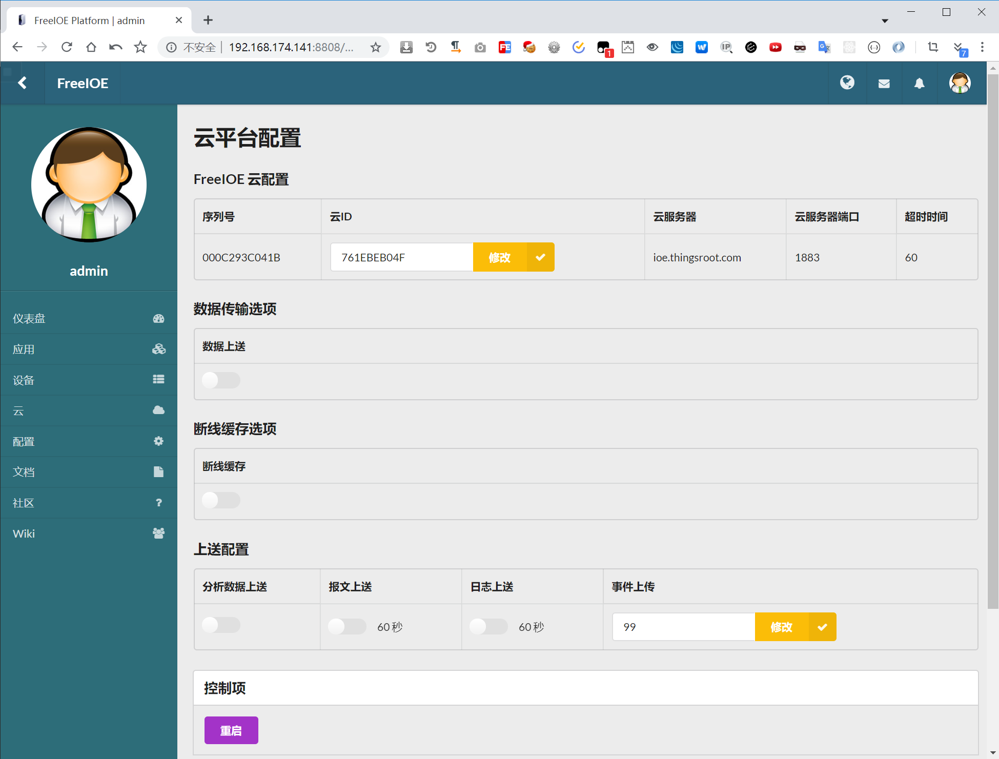

# ThingsLink网关/FreeIOE虚拟机

## ThingsLink网关

ThingsLink网关的型号如下表：

| 型号 | LAN1默认设置     | 说明                                                             |
| :--- | :--------------- | :--------------------------------------------------------------- |
| Q102 | 192.168.0.245/24 | CPU 1*Core 528 Mhz/内存 256 Mb/存储 4GB / 1网口 / 2串口 / 4G选配 |
| Q204 | 192.168.0.245/24 | CPU 1*Core 800 Mhz/内存 512 Mb/存储 4GB / 2网口 / 4串口 / 4G选配 |
| C202 | 192.168.1.248/24 | CPU 4*Core 1 Ghz/内存 256 Mb/存储 4GB / 2网口 / 2串口 / 4G选配   |

如使用ThingsLink网关，请阅读网关配套的出厂说明书对网关进行安装配置并联网。

## FreeIOE虚拟机

FreeIOE虚拟机的下载地址如下：

点击下载  [FreeIOE虚拟机](https://thingscloud.oss-cn-beijing.aliyuncs.com/download/freeioe.zip)

预装了FreeIOE软件的虚拟机使用步骤如下：

1. 解压freeioe.zip文件，将得到名为freeioe_openwrt_amd64_19.07.0.ova的文件。
2. 运行虚拟机软件（这里以VMware Workstation为例），选择文件菜单中的打开（快捷键是Ctrl +  O），选中freeioe_openwrt_amd64_19.07.0.ova文件，点击打开。

3. 给freeioe虚拟机取个名，导入即可。

4.  VMware出现导入错误提示（关于规范性，一致性的提示），不用管，点击“重试”即可

5.  导入成功后，可以看见freeioe虚拟机的配置信息，硬件信息可根据自己需要更改。可将freeioe虚拟机的“网络适配器1”连接到“桥接网络”，“网络适配器 2”连接到“NAT”。

6. 启动freeioe-test虚拟机，如果你本机能连接互联网，那么freeioe-test虚拟机应该可以连接互联网。
7. freeioe虚拟机系统采用的是openwrt开源路由系统，第一块网卡是LAN模式，默认IP地址是192.168.1.1；第二块网卡是WAN模式，默认是自动获取IP地址。freeioe虚拟机运行后敲击回车键进入console模式后，将会打印出br-lan口和eth1口当前的IP地址。

8. 在虚拟器中ping一下冬笋云地址(cloud.thingsroot.com)，如能ping通，则表明FreeIOE虚拟机已经可连接到冬笋云了；如不能ping通，检查一下你的主机是否可以访问冬笋云，或者FreeIOE虚拟机的设置中第二块网卡不是NAT模式，或者FreeIOE虚拟机中网络接口关联的网络顺序反了。

9. 浏览器中输入在Console模式中看到的eth1的IP地址，可访问freeioe的系统管理页面，在浏览器中输入eth1的IP地址并在后增加":8808"。输入默认用户名/密码：admin/admin1。可访问FreeIOE的管理页面。

10. 登录冬笋云后将申请的“虚拟网关”序列号通过FreeIOE管理界面设置到云ID后并重启FreeIOE。

以上就是FreeIOE虚拟机的搭建过程。 

[FreeIOE虚拟机安装及配置视频](http://1254404623.vod2.myqcloud.com/e9ab2701vodcq1254404623/8ea5fe445285890796668449177/brNL8lWG5pAA.mp4)

接下来，介绍如何搭建一个[工业设备/模拟器](device-simulator.md)的环境。