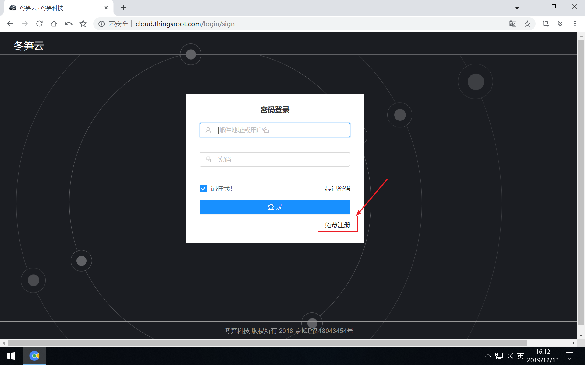
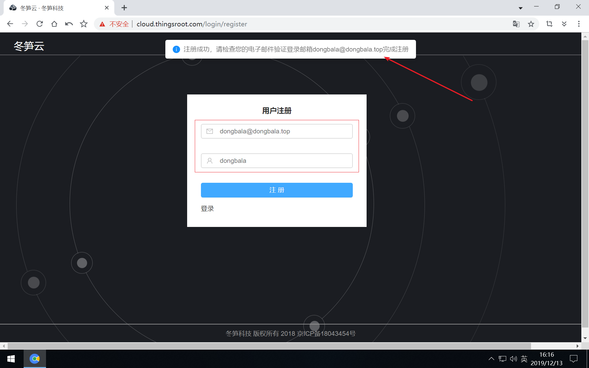
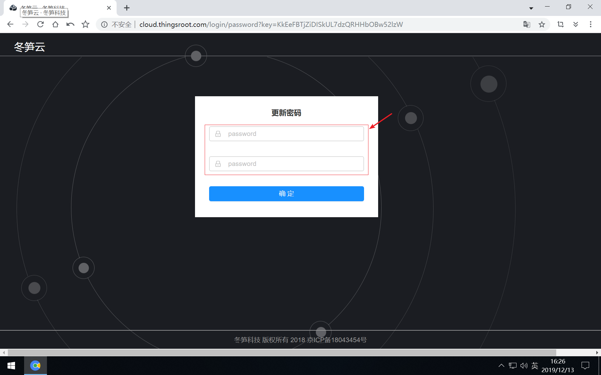
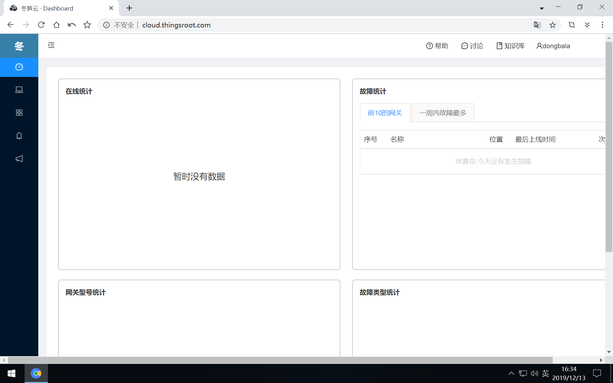

# 注册&登录

如是首次使用冬笋云平台，需要先注册用户后才能使用冬笋云平台提供的功能。

## 新用户注册
在浏览器中打开[冬笋云](https://cloud.thingsroot.com)后，在登录按钮的右下方有“免费注册”的链接，点击它就进入用户注册的界面。

在用户注册页面，你必须输入正确的邮箱地址（注册成功后给此邮箱发送一封主题为“完成注册”的邮件），点击注册按钮，等待几秒后，会提示注册成功。

登录注册时填写的邮箱，找到主题为“完成注册”的邮件（发件人为ThingsCloud_Admin <cloud@thingsroot.com>），按照邮件中的提示点击“完成注册”按钮，跳转到冬笋云的更新密码页面。在密码框在两次输入相同的密码后，点击确定按钮。

## 用户登录

已经注册过的用户在登录页面输入注册时使用的邮箱地址（用户ID）或者注册时输入的用户名和登录密码就能登录冬笋云了。

登录冬笋云平台后，默认进入的是控制台页面。由于是首次使用平台，因此账号下面没有绑定网关，在控制台也就不会有任何的统计数据。

初次使用平台，我们首先要将网关绑定到自己账户名下，接下来介绍如何[绑定网关](Gate-bind.md)。

