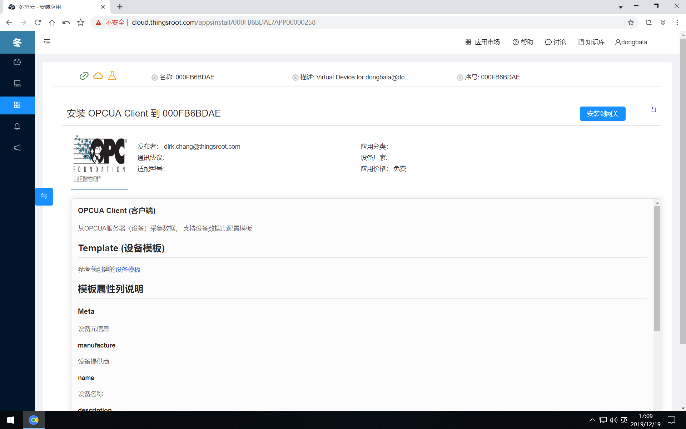

# 应用安装&配置

当用户上线一台新网关时，网关中并未安装运行任何应用，因此我们必须对网关安装应用并配置，在我的网关列表中选择需要操作配置的网关，通过“设备”按钮或“应用”按钮进入目标网关的配置页面。在平台上浏览从未使用过的网关时，"设备列表"只有网关自身的变量数据，而"应用列表"则完全为空。

当需要给网关安装应用时，点击页面右上角的“安装新应用”按钮，在应用展示页面中浏览需要的应用或者在“过滤搜索框”中输入应用的名称或选择应用标签进行应用过滤。

点击应用图标，将进入应用详情页。

点击应用右下方的安装图标或者在应用详情页中点击安装到网关按钮，将进入应用配置的界面。

FreeIOE的应用都是由不同的开发者开发的，由于应用的功能不同，所以应用是否提供配置界面，应用的配置界面如何构成，都是有应用开发者决定，所以每一个对每一个FreeIOE应用进行配置时，最好先阅读应用开发者提供的应用帮助文档，点击应用配置界面右侧的“帮助”按钮，在新窗口中会打开应用的帮助文档。请认真阅读应用的帮助文档后再进行安装配置。如在使用过程中遇到任何问题，可在社区寻求帮助，也可在应用详情中反馈问题给开发者。