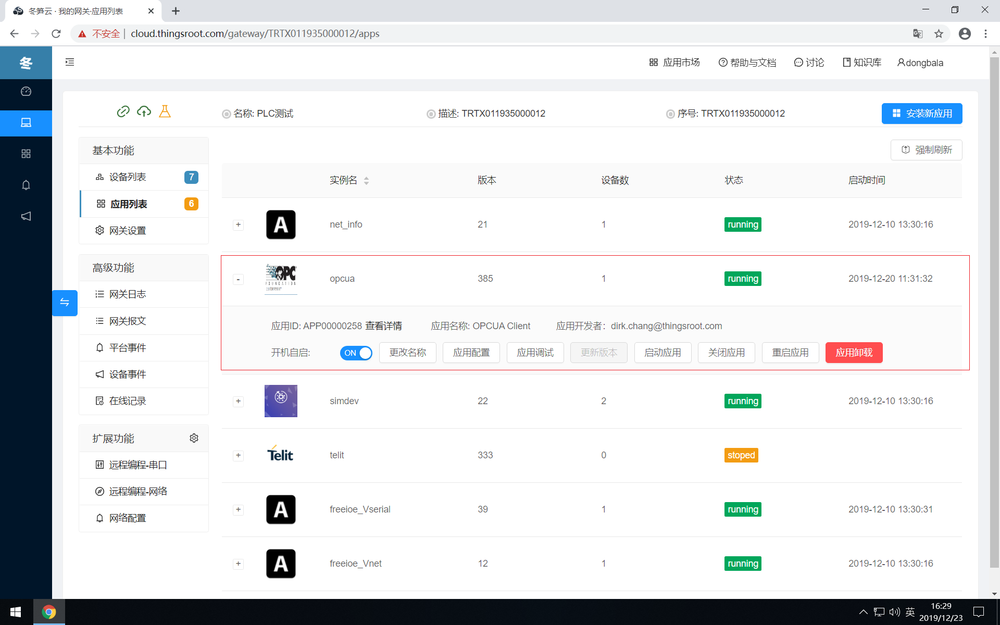

# 应用管理&升级

在网关中安装各种功能的应用后，用户可通过“应用”列表来查看应用的运行状态，运行实例名称，当前版本号，应用包含的设备数量，启动时间等信息；亦可对已经安装的应用进行“修改运行实例名”，“修改应用运行参数”，“升级应用”，“启动应用”，“关闭应用”，“重启应用”，“应用卸载”等操作，还提供在线调试应用代码的功能。

## 应用运行状态信息

**运行实例名**——应用在网关中的运行实例名为FreeIOE管理运行实例的一个标识，在同一网关中应用的运行实例名须保持唯一，FreeIOE中允许的实例名称仅支持字母、数字、下划线。网关中的应用运行实例名和应用市场中的应用名称不需要一样。

**版本号**——应用在网关中安装的版本号，用户可根据实际的情况来绝对当前应用是否需要升级。

**设备数**——应用运行后所包含的设备数量，应用中包含多少设备，有应用功能及其配置参数相关，详情可看应用提供的帮助文档。

**启动时间**——当前应用启动的时间。

**应用ID**——当前应用在应用市场中的ID。

**应用名称**——当前应用在应用市场中的名称。

**应用开发者**——当前应用的开发者ID（冬笋云平台的用户ID）

## 应用管理功能

**开机自启**——当前应用是否根据FreeIOE软件开机自启动。

**更改名称**——更改当前应用的运行实例名。

**应用配置**——更改当前应用的配置参数面板，FreeIOE应用是否支持配置参数或者支持配置面板，由应用开发者决定，详情须参考应用帮助。

**更新版本**——应用在当应用市场中的版本如大于当前版本，则版本号一列会提示“升级”箭头，同时“更新版本”按钮可点击，当点击“更新版本”按钮后，会出现应用最新版本的升级日志，用户在阅读升级日志后决定是否需要升级当前应用。

**启动应用**——给FreeIOE发出启动当前应用指令。

**关闭应用**——给FreeIOE发出关闭当前应用指令。

**重启应用**——给FreeIOE发出重启当前应用指令。

**应用卸载**——给FreeIOE发出卸载当前应用指令。为避免误删除，卸载应用会弹出确认对话框。

## 应用在线调试

**应用调试**——启动代码编辑器对当前应用的代码进行编辑并同步下载到网关中覆盖当前应用，这是冬笋云平台为开发者开发调试FreeIOE应用提供的一个便捷功能。因此用户需要使用此功能，需满足2个条件：
* 当前用户须已成为FreeIOE应用开发者，申请FreeIOE应用开发者可在“我的应用”页面中申请。
* 当前网关须已经开启调试功能，网关调试功能可通过“网关属性”→“高级设置”开启。
