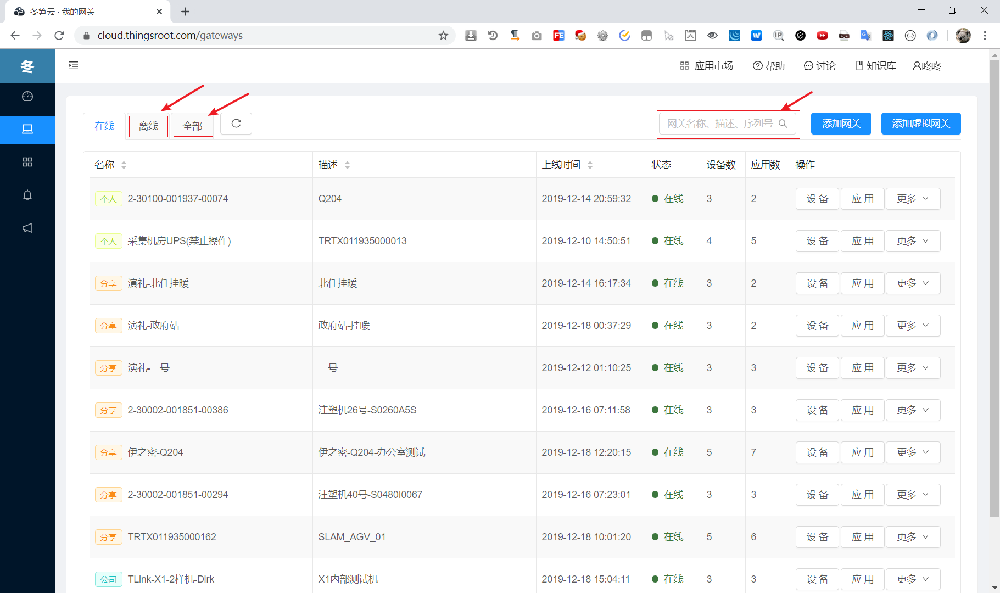
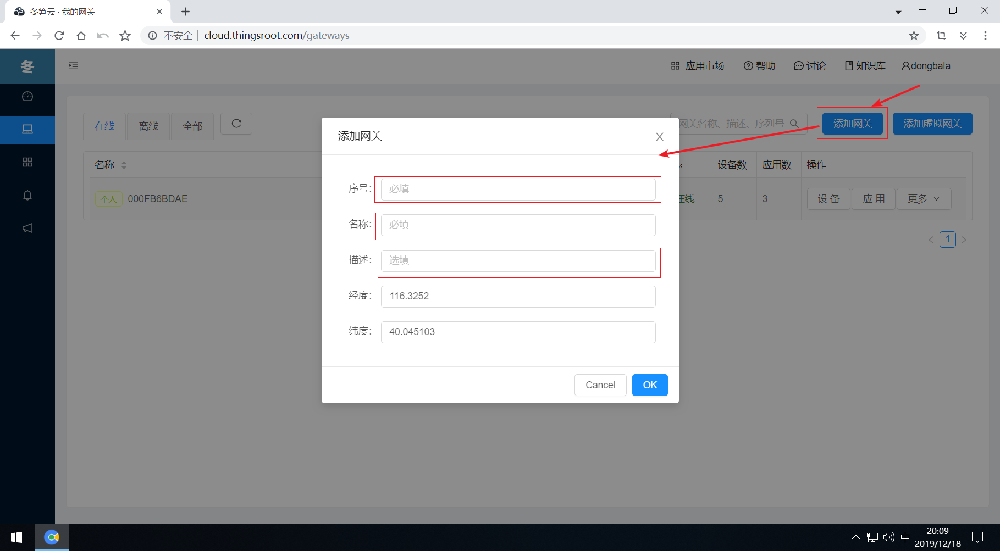
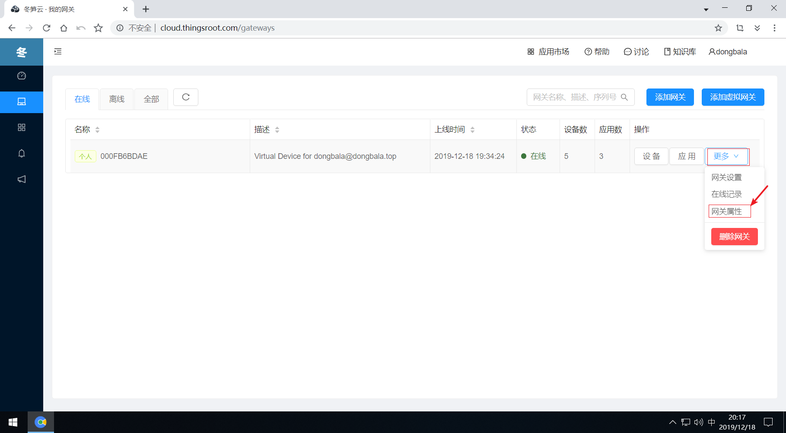

# 网关绑定&属性修改

在“我的网关”页面中，用户可看到所有有权限能访问的网关，包括：

* 个人网关——只能是自己可见，不能分享。平台提供给用户进行体验测试的网关只能属于个人。
* 公司网关——当用户属于某个组织的一些群组后，用户可以访问公司这些群组下的网关。
* 分享网关——这类网关为平台中其他组织由于协同支持或其他需要分享给用户的网关。其他组织可以随时取消对此用户的分享。

在“我的网关”页面，用户默认视图为所有当前在线的网关，用户可通过网关列表上面的标签页查看“离线”网关或“全部”网关。用户还可通过搜索框输入过滤关键词（网关序列号，网关名称，网关描述）查找满足条件的网关。

## 添加网关

点击“添加网关”按钮，在弹出的窗口中输入网关的序列号（网关序列号可在网关机身上找到），网关名称，网关描述等信息。确认正确后，点击“确定”按钮即可。

注意：

    ThingsLink Q102或Q204首次添加时需要联系系统管理员将网关序列号注册到系统中才能使用。

## 添加虚拟网关
点击“添加虚拟网关”按钮，将进入到“[虚拟网关](FreeIOE-VM.md)”页面，用户可在“[虚拟网关](FreeIOE-VM.md)”页面申请虚拟网关序列号并了解如何使用虚拟网关序列号。

## 网关属性修改

如希望修改某台网关的属性（名称、描述，经纬度等），点击网关最右侧的"更多"按钮，在下拉菜单中选择“网关属性”，在弹出的属性修改窗口中输入新的属性值并点击确定按钮即可。

