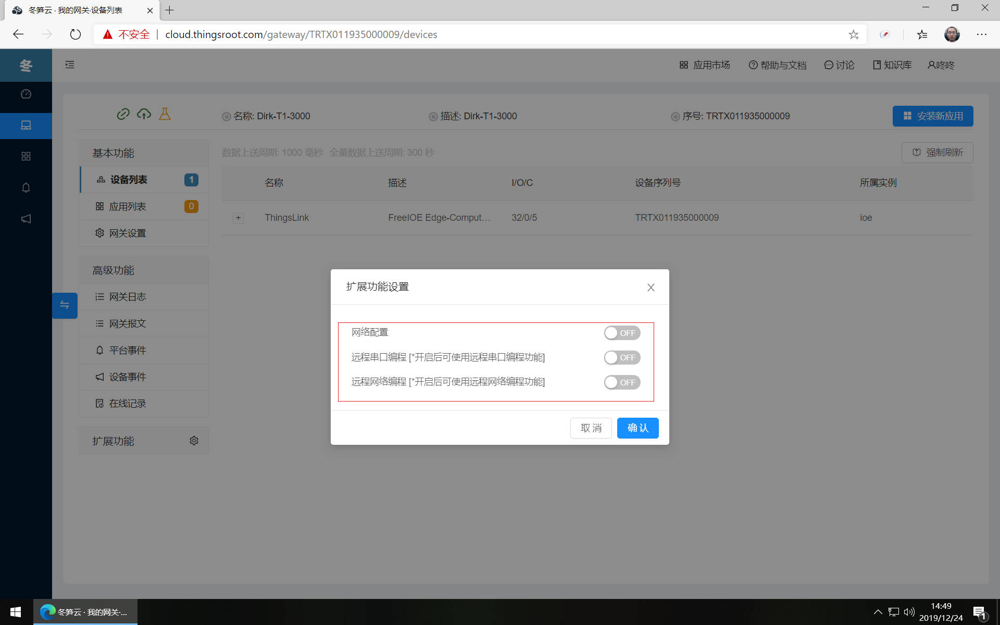

# 网关扩展功能

网关所提供出来的所有功能都是由FreeIOE应用拓展出来的。由于部分FreeIOE应用涉及到和其他软件的交互或者需要给用户提供较为专用的操作页面，因此将这部分应用拿出来作为网关的扩展功能，需要使用这些扩展功能的用户根据自己的需要在网关中开启相应的扩展功能即可。

目前网关支持的扩展功能如下，点击下面的链接查看扩展功能的描述及帮助。

* [网络远程编程](https://wiki.freeioe.org/doku.php?id=apps:app00000135)
* [串口远程编程](https://wiki.freeioe.org/doku.php?id=apps:app00000130)
* [网关网络配置](https://wiki.freeioe.org/doku.php?id=apps:app00000115)