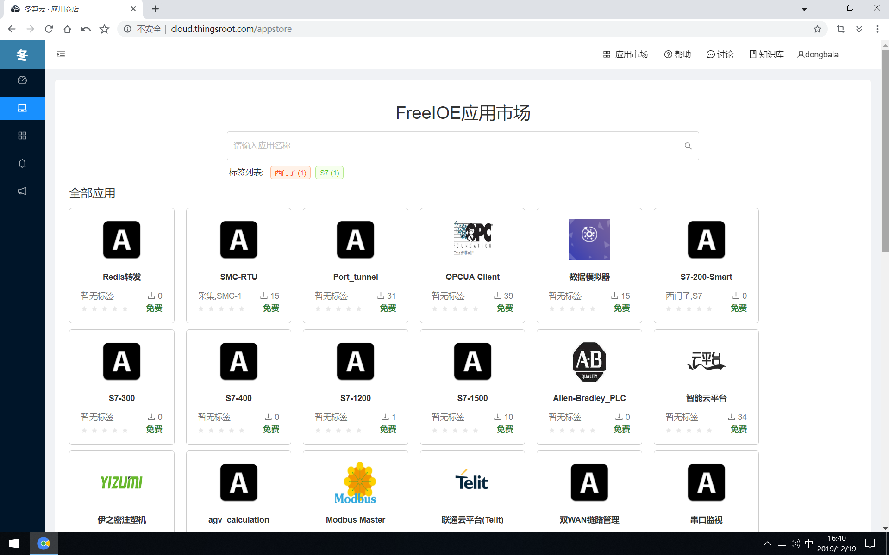

# 如何选择正确的应用

FreeIOE是一个物联网边缘计算开发框架，本身并不包含具体的业务功能。希望网关具备什么样的功能主要看安装了什么样的FreeIOE应用，这种方式有点类似智能手机，智能路由器的概念。

因此，我们在实际的应用场景中使用网关来解决具体的问题时，需要先明确实际的需求，有明确的需求才便于在冬笋云的应用市场中找到正确的应用。也许目前在冬笋云的应用市场中也找不到满足需求的应用，但冬笋云的应用市场是一个FreeIOE应用的汇总分发市场，应用市场中的应用也在不断的增加和完善，因此用户需要的应用也终能找到；另外FreeIOE是一个接口完全开放且应用源码开放的框架，开放应用具有快速高效等特性，用户也可以考虑学习[FreeIOE应用开发指南](https://freeioe.gitbook.io/doc/)来开发满足自己需求的应用。

登录冬笋云平台后，可通过顶部导航的“应用市场”浏览市场中的所有应用。

