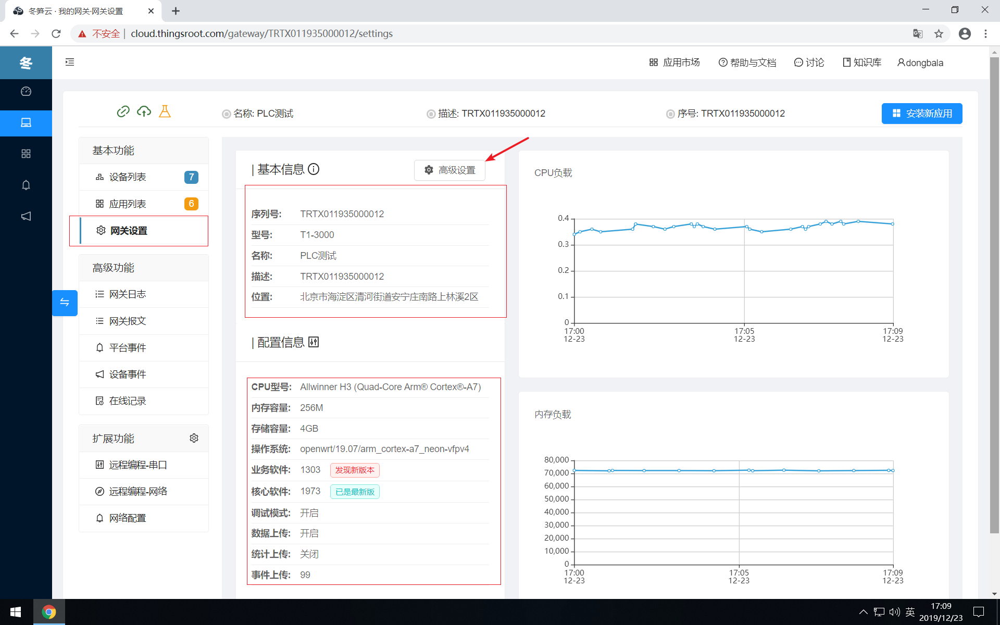
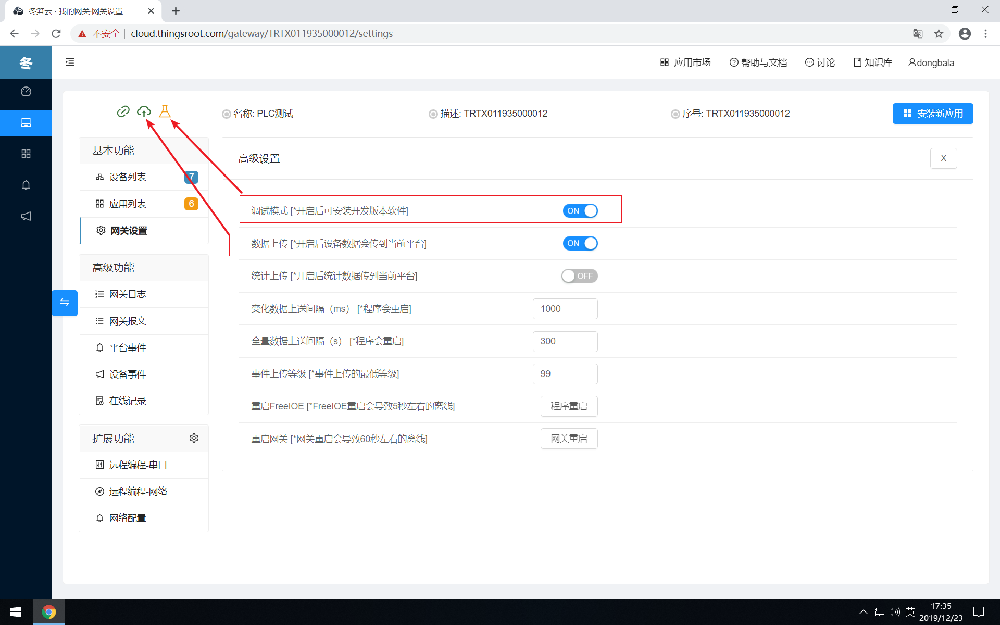

# 网关设置&固件升级

网关提供了自身信息及运行状态的监控，用户可通过“网关设置”页面查看，网关设置页面由4个部分组成：基本信息，配置信息，高级设置，监控图表。

## 基本信息
这部分为网关的一些基本信息，包括：

| 项目   | 描述                 |
| ------ | -------------------- |
| 序列号 | 网关的序列号         |
| 型号   | 网关的产品型号       |
| 名称   | 用户给网关定义的名称 |
| 描述   | 用户给网关定义的描述 |
| 位置   | 网关所在地理位置     |

## 配置信息
这部分为网关的一些硬件信息及系统参数，包括：

| 项目           | 描述                                                         |
| -------------- | ------------------------------------------------------------ |
| CPU型号        | 网关的CPU型号                                                |
| 内存容量       | 网关的运行内存容量大小                                       |
| 存储容量       | 网关的存储容量大小                                           |
| 操作系统       | 网关的操作系统信息                                           |
| 业务软件版本号 | FreeIOE软件的版本号                                          |
| 核心软件版本号 | Skynet软件的版本号                                           |
| 调试模式       | 网关是否打开调试模式，可在高级设置中开启或关闭               |
| 数据上传       | 网关是否打开应用数据上传冬笋云的功能，可在高级设置中开启或关闭 |
| 统计数据       | 网关是否打开应用统计数据上传冬笋云的功能，可在高级设置中开启或关闭 |
| 事件上传级别   | 网关向冬笋云平台上传FreeIOE应用事件的最低等级，大于此设定事件等级的事件都会上传冬笋云 |

## 监控图表
目前仅包含网关最近10分钟的CPU负载和内存负载的历史曲线。

## 高级设置
网关的高级设置页面可修改网关的部分默认参数，高级设置可调整的参数包括：

| 项目   | 描述                 |   默认值   |
| ------ | -------------------- |-------------------- |
| 调试模式  | 是否开启网关的调试模式，开启后网关状态栏会出现调试图标  |       不开启     |
| 数据上传  | 是否将网关应用数据上传到冬笋云平台，开启后网关状态栏会出现上传图标   |   不上传 |
| 统计上传  | 是否将网关应用统计数据上传到冬笋云平台 |  不上传  |
| 变化数据上送间隔   | 网关上传变化数据到冬笋云平台的时间间隔 | 1000 ms |
| 全量数据上送间隔   | 网关上传所有数据到冬笋云平台的时间间隔     | 300 s |
| 事件上传等级   | 网关向冬笋云平台上传FreeIOE应用事件的最低等级，大于此设定事件等级的事件都会上传冬笋云     | 99 |

