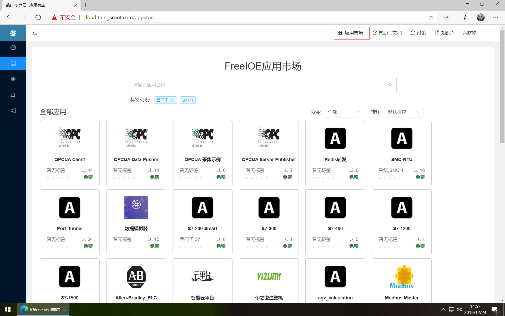
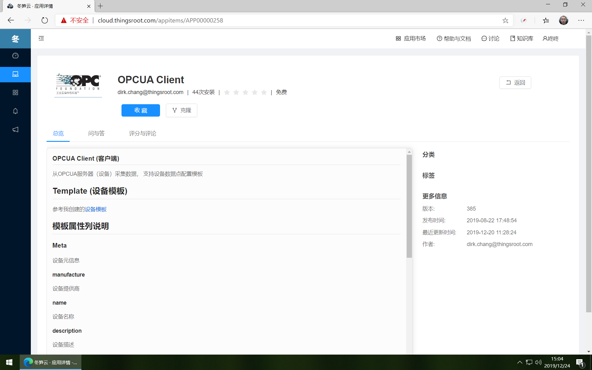
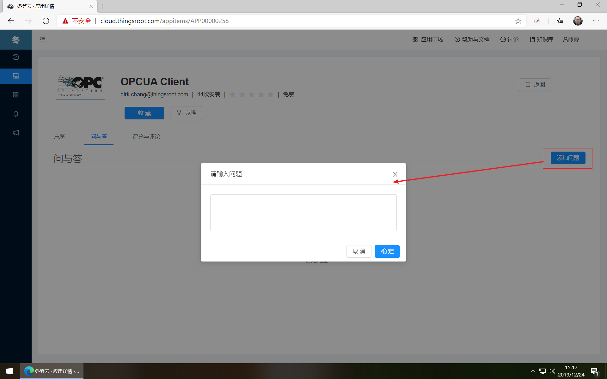
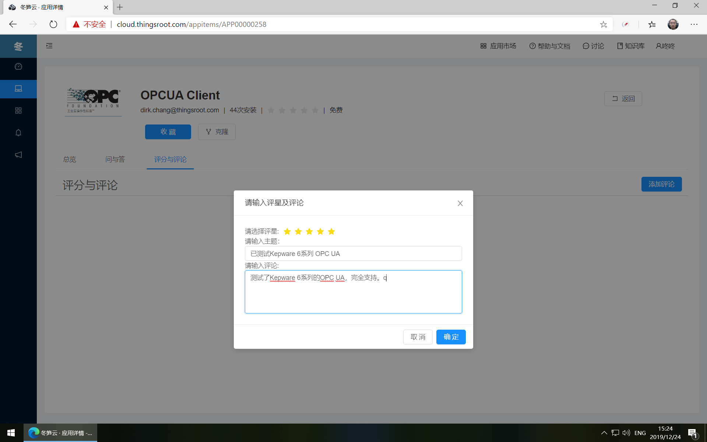

# 应用市场

冬笋云应用市场是FreeIOE应用的一个分发平台，这里收录了冬笋科技官方和第三方应用开发商开发的FreeIOE应用。所有内置FreeIOE软件的网关安装此应用市场发布的应用。

用户登录后，可点击顶部导航中的“应用市场”进入FreeIOE应用市场。

## 应用过滤

用户可通过应用名称，应用标签，应用分类等方式过滤，也可通过应用名称，创建时间，更新时间等方式排序。

## 应用详情

点击应用卡片，可进入应用的详情页面。在应用详情页面，可看到应用的名称，图标，开发者，应用下载安装次数，应用评星等信息，应用下方提供了应用概述、问与答，评星与评论板块，在右侧显示了应用更加详细的信息，如应用分类，应用标签，最新版本，首次发布时间，最新更新时间等信息。

## 收藏或克隆
用户可将自己关注的应用放入自己的应用收藏夹，应用被收藏后，用户进入“我的应用”→“收藏的应用”页面可查看和管理所有收藏的应用。

如用户已申请了冬笋云平台的FreeIOE应用开发者身份，那么可将应用市场中的应用当前版本克隆到自己名下，并可修改或编辑应用的代码以满足自己的特定需求。

## 问与答

在应用的“问与答”标签页中，用户可通过“添加问题”按钮向开发者或其他使用者提问，亦可针对其他用户的问题进行回复。

## 评分与评论

在应用的“评分与评论”标签页中，用户可通过“添加评论”按钮给应用添加评分和评论。

