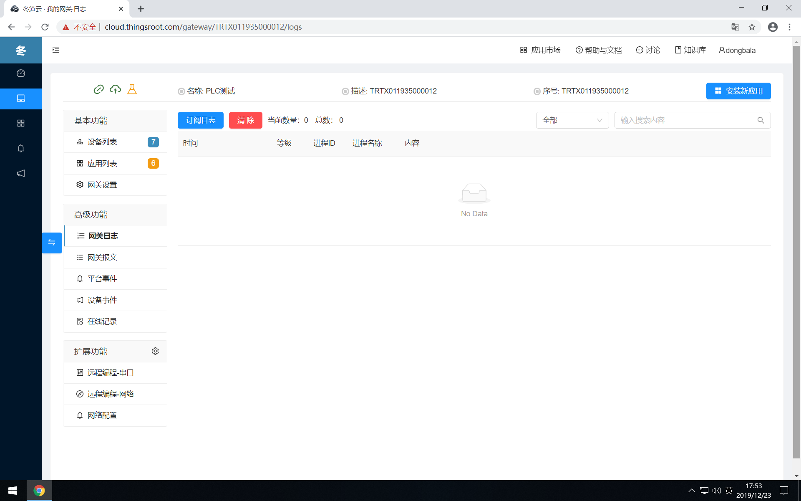
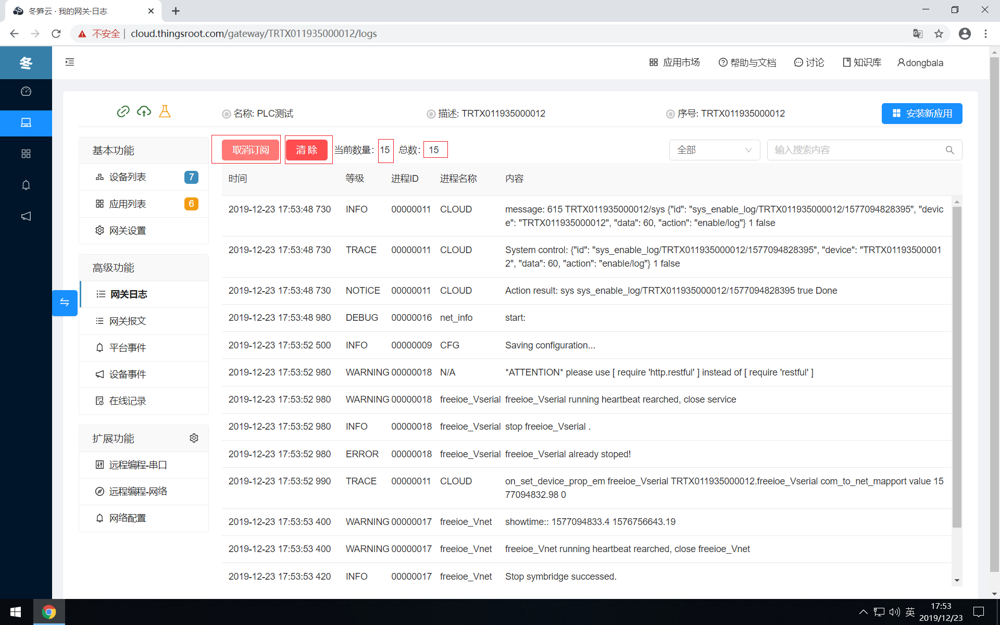
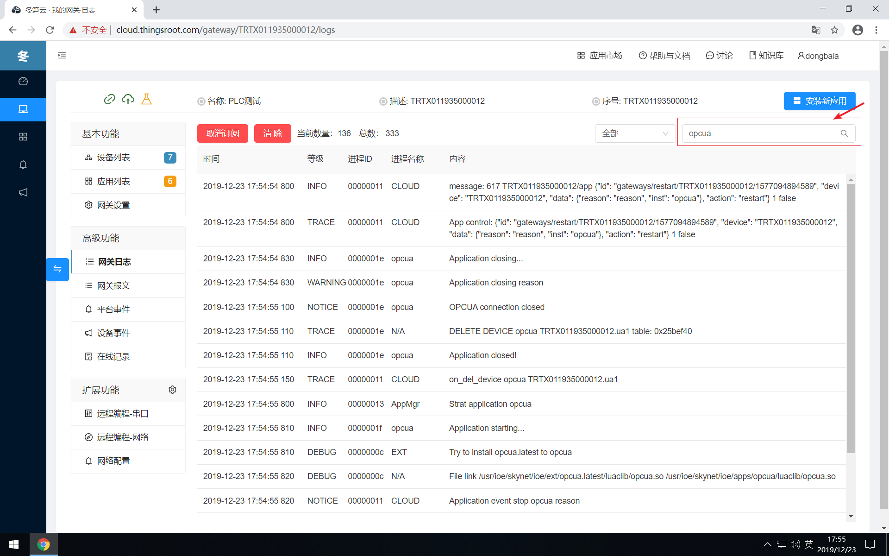
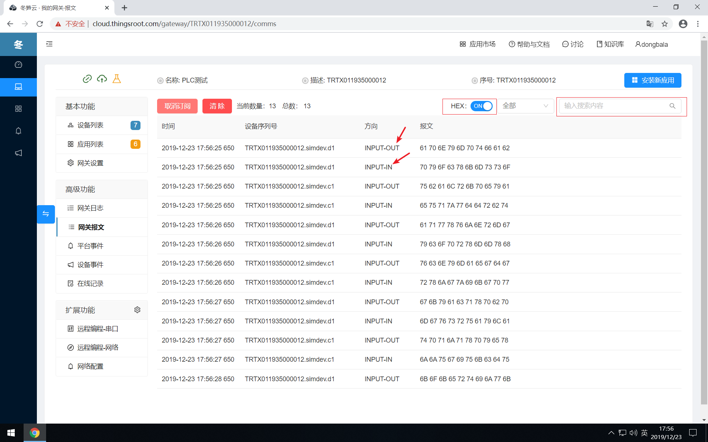

# 设备通讯调试&诊断

在安装运行FreeIOE应用的过程中，不可避免的会出现各种错误，如应用无法运行，应用运行异常，设备无数据，数据错误等等错误，遇到这些错误时，可借助冬笋云平台提供的“网关日志”和“通讯报文”功能来分析诊断应用的运行错误或设备通讯错误。

## 网关日志

日志是FreeIOE中是记录应用运行过程中的信息。用户可以在ThingsCloud平台上通过网关日志来检查应用运行的过程的记录或错误发生的原因。

进入某个网关后，在左侧的导航菜单中选择网关日志，即可进入网关的日志浏览界面，

点击“订阅日志”按钮后，平台会向网关下发指令，让网关将最新的日志实时的发送到平台，从此刻开始，远程的网关只有有新的日志，就会实时的日志发送到平台，由于在平台上查看网关的日志会消耗网关的网络流量以及占用服务器的上传带宽，因此每个客户端每次接收的日志条数最多是5000条，超过5000条后，用户需要清除列表中的日志后才能继续继续，如下图所示：

对接收的日志，页面中对日志等级，应用实例ID，日志内容提供了过滤功能。用户可见过滤关键词（如应用实例名称）输入过滤输入框中，列表将显示符合条件的日志信息，如下图所示：

## 通讯报文

通讯报文是FreeIOE中是记录应用和目标设备之间的交互信息。用户可以在ThingsCloud平台上通过通信报文来检查应用和目标设备之间的通信信息和追踪错误时发生的交流信息。

进入某个网关后，在左侧的功能列表导航中选择网关报文，即可进入网关的报文浏览界面。

点击“订阅报文”按钮后，平台会向网关下发指令，让网关将最新的报文实时的发送到平台，从此刻开始，远程的网关只有有新的报文，就会实时的报文发送到平台，由于在平台上查看网关的报文会消耗网关的网络流量以及占用服务器的上传带宽，因此每个客户端每次接收的报文条数最多是5000条，超过5000条后，用户需要清除列表中的报文后才能继续继续，如下图所示：

通讯报文默认是以二进制(十六进制字符)显示，可切换为ASCII码显示。支持对设备序列号，方向，报文内容的过滤。

**注意**：报文方向的内容由应用开发者自行提供。
