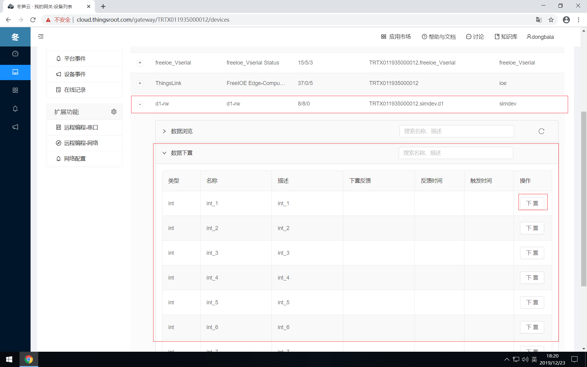

# 设备数据查看&下置

当FreeIOE应在物联网数据采集或物联网边缘计算等场景中时，当应用安装并运行正常后，系统使用者都需要及时知道应用所采集的设备数据是否正确，应用计算的结果是否正确，应用处理的逻辑是否达到要求等等。因此，在冬笋云平台，为使用者提供了设备数据查看&下置的功能。

在网关操作的左侧功能导航菜单中点击设备列表，可查看网关中的所有设备（包含网关自身，设备列表中，名为ThingsLink的设备就是网关自身的内部变量）及其数据。

## 设备数据查看

网关中FreeIOE的默认设置是不像冬笋云平台上传应用的数据，因此当打开设备列表页面时，页面右上角会出现开启临时数据上传的功能按钮，此时如果点击设备展开设备的变量列表，将看不到设备变量实时数据，或者看到的数据是上一次上传后保留的数据。因此，如要查看设备当前最新的实时数据，则需要点击“开启临时数据上传”按钮，亦可修改网关设置→高级设置中的数据上传参数。

## 设备数据下置/控制指令

冬笋云平台的设备列表页面提供设备数据下置的功能，设备是否支持数据下置功能，受设备关联的应用或设备点表决定。当我们展开设备时，就可以看到3个表格：数据浏览、数据下置，控制指令。如某个设备支持数据下置/控制指令功能，那么数据下置/控制指令就可以展开。如数据下置表格展开后，我们可以看见设备支持可写入数据的变量名称。

点击可写入数值的变量后面的下置按钮，将弹出“数据下置”面板，在输入框中输入设备支持的数据，即可将设定的值写入到设备中。

如向设备下置数据成功，在变量的下置反馈，反馈时间，触发时间将显示执行的结果。

如设备支持控制指令，也是类似的过程。