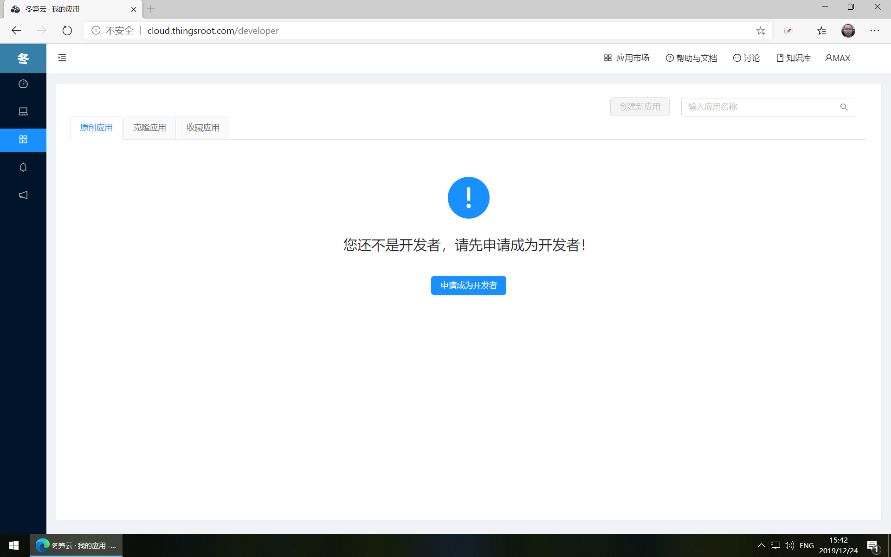
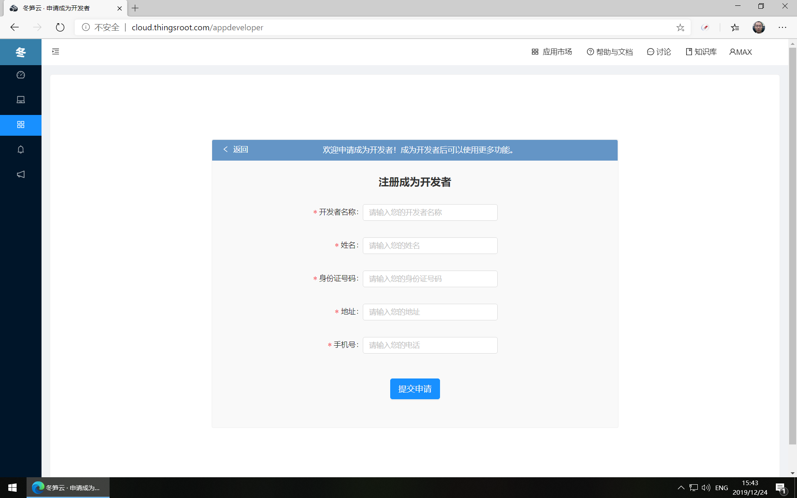
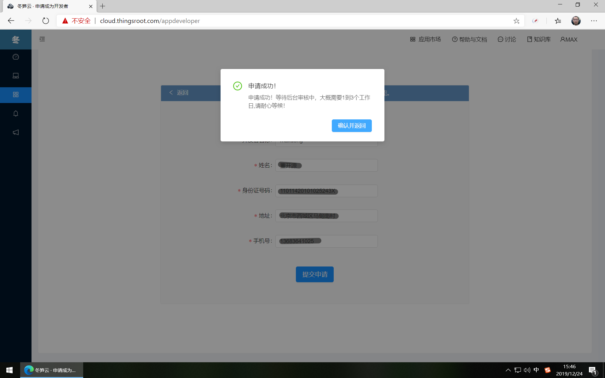

# 开发者申请

在冬笋云注册的用户，默认并不具有FreeIOE应用开发者身份，如用户希望成为FreeIOE应用开发者，需要到“我的应用”页面去申请程序开发者。

点击“申请成为开发者”按钮，进入申请表单。

输入开发者名称，身份证上的姓名，身份证号码，地址，手机号等必填信息后，提交申请表单内容。

提示申请成功后，耐心等待1、2个工作日。再到此页面查看是否已经成为FreeIOE应用开发者。如已成为FreeIOE应用开发者，则页面中不再出现“申请成为开发者”按钮。

接下来，就可以[创建应用](my-app-manager.md)或[克隆应用](my-fork-app.md)了。