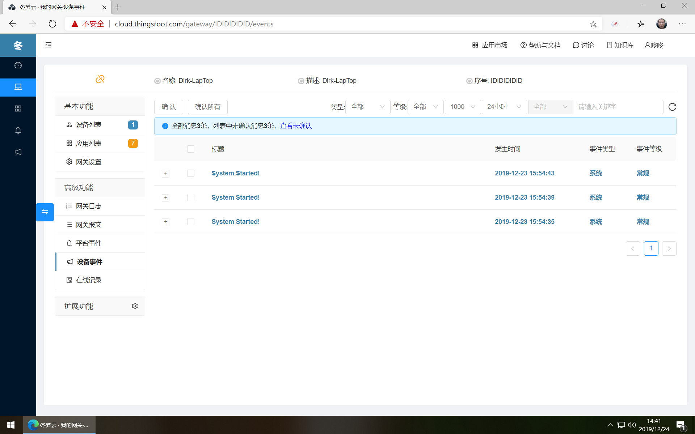
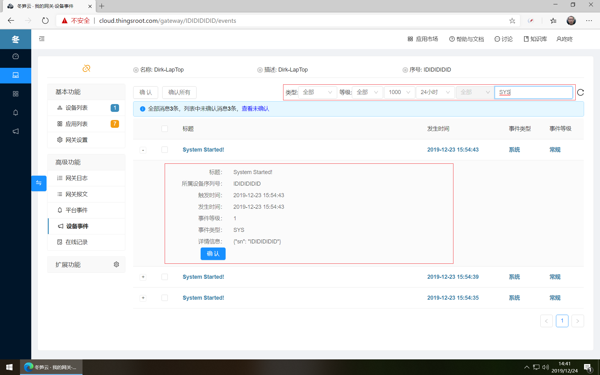

# 设备事件记录跟踪

冬笋云提供了记录设备事件的功能，在网关中的应用可将自己产生的事件或和设备通讯，数据计算等产生的事件推送到冬笋云平台，是否产生事件，是否推送到冬笋云平台，以及推送哪种级别的事件到冬笋云平台，是由应用自己及网关系统参数决定，网关默认只推送事件等级大于和等于99的事件，用户可在网关设置→高级设置中修改。网关推送事件的格式及内容需要参考应用自己的帮助说明。

同时页面也提供事件类型，最近时才，以及关键词等过滤条件，方便用户快速找到需要的记录。

