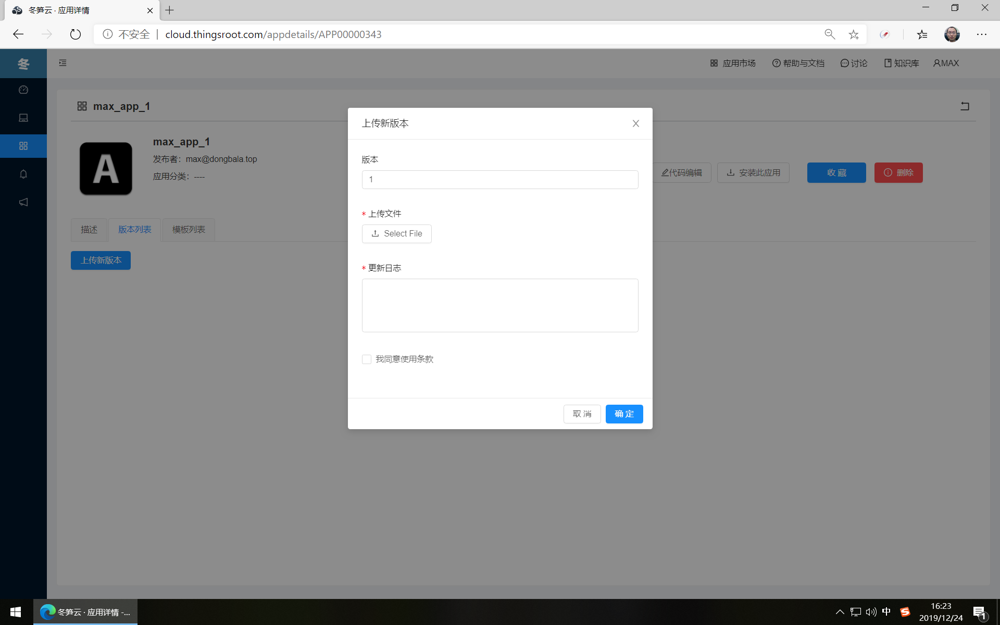

# 原创的应用

原创应用是管理开发者自己应用的一个页面。

## 创建应用

开发者通过右侧的“创建新应用”按钮创建一个新的应用。

## 应用信息填写

在新应用的创建页面，需要输入如下信息：

| 项目   | 描述                 |     备注   |
| ------ | -------------------- |--------------- |
| 应用名称 | 在应用市场显示的名称         | 确保在自己名下无重名即可  |
| 应用ID   | 应用的打包名称，只支持英文、数字、下划线       |  确保在自己名下无重名即可   |
| 授权类型   | 免费 | 当前只支持免费   |
| 发布到应用市场   | 应用是否发布到应用市场让其他用户下载使用 |  不发布到市场就只能自己看见  |
| 描述   | 应用的描述信息     |  markdown语法格式 |

## 应用详情

新应用创建完成后，开发者可看见应用的信息并提供应用修改、代码编辑、安装到网关、删除、上传新版本、管理设备模板等功能。

## 应用新版本上传

新创建的应用并未包含任何代码，因此应用不具有任何功能，开发者可使用平台提供的代码编辑功能编写代码或通过版本列表的新版本上传按钮上传应用压缩包，通过编辑器开发FreeIOE应用的文档请参考[FreeIOE 应用开发](https://freeioe.gitbook.io/doc/)。

## 应用默认配置参数

冬笋云平台给开发者提供了一个通用型的应用配置面板，开发者可阅读[FreeIOE 应用开发](https://freeioe.gitbook.io/doc/)。

## 安装应用到网关

已经有版本上传的FreeIOE 应用，可安装到用户名下的测试网关中（测试网关需在“网关设置”的“高级设置”中开启调试模式）。

## 删除应用

如开发者发布的应用未安装到任何网关，应用可被删除。删除时会有警告提示。

