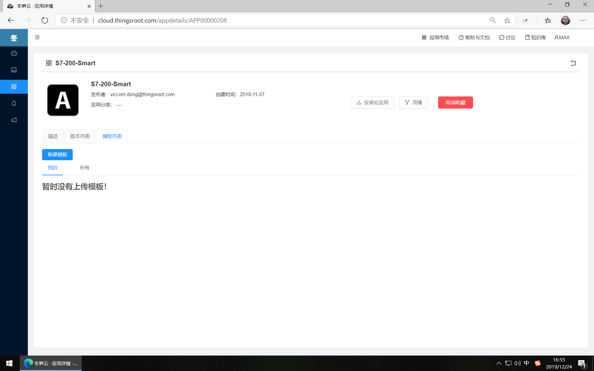
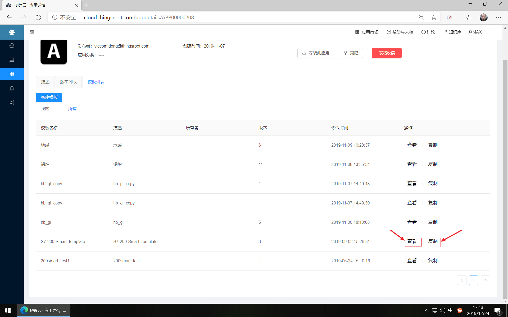

# 应用设备模板

FreeIOE应用在实际使用中，不少应用都支持设备模板的功能（及应用可加载用户自定义的设备模板去采集目标设备中的变量）。因此用户使用的应用如支持设备模板功能时，应先将应用收藏到自己名下，后期可在“我的应用”→“收藏应用”中管理应用的设备模板。

当用户从未给应用创建过设备模板时，在应用详情的模板列表下的我的模板是没有自己的设备模板的，用户可通过阅读应用帮助或浏览应用的所有设备模板来克隆创建自己的设备模板。

