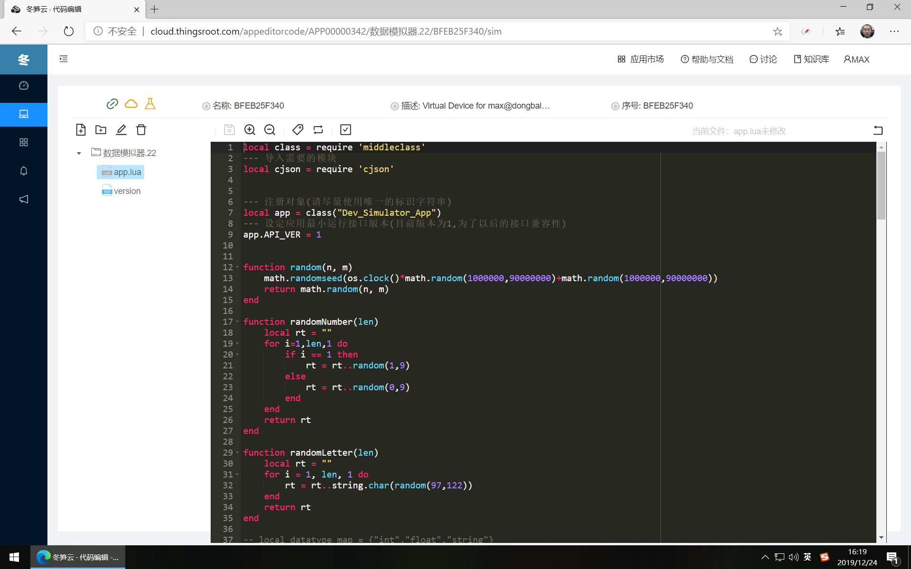

# 克隆的应用

克隆应用是指开发者将FreeIOE应用市场中的应用的当前版本克隆到自己名下，开发者可在此应用代码的基础上增添修改应用代码，以适应自己应用场景的需要。

## 在应用市场中克隆应用

在应用市场中进入某应用详情页面时，可通过“克隆”按钮将应用的当前版本克隆到开发者名下，应用的不同版本可再次克隆。

## 在网关应用列表中克隆应用

进入网关的应用列表，展开应用，通过应用下面的“应用调试”按钮，将非开发者原创的应用克隆到开发者名下。

**注**：应用调试功能需要网关在“网关设置”的“高级设置”中开启调试模式。

点击“应用调试”按钮后，出现提示对话框。

点击“OK”按钮，将非开发者原创的应用被克隆到开发者名下同时进入了代码编辑状态。

